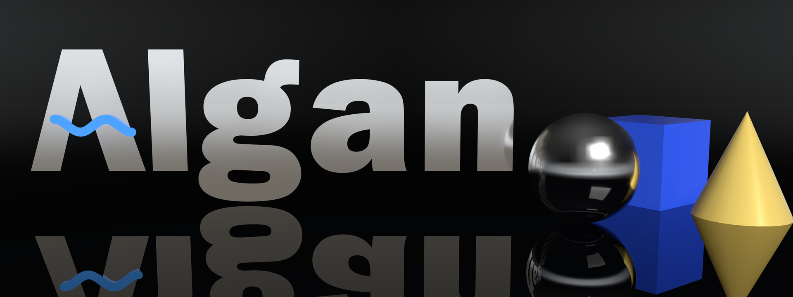

<p align="center">
  <a href="https://algorithmicsimplicity.github.io/algan"></a>
</p>

<p align="center">
  <a href="https://algorithmicsimplicity.github.io/algan">Watch the 16-second demo</a> &mdash; every frame of it, and the logo above, is rendered by Algan (<code>branding/</code>).
</p>

<p align="center">
  <strong>Full-featured 2D/3D programmatic animation engine for explanatory mathematics and technical videos.</strong>
</p>

<p align="center">
  <a href="https://algorithmicsimplicity.github.io/algan"></a>
  <a href="https://pypi.org/project/algan/"></a>
  <a href="https://pypi.org/project/algan/"></a>
  <a href="https://discord.gg/NvarFmvXKm"></a>
  <a href="https://github.com/algorithmicsimplicity/algan/blob/master/LICENSE"></a>
</p>

---

Algan is designed to be a successor to Manim with full-featured 3-D raytracing capabilities.

As seen on [AlgorithmicSimplicity](https://www.youtube.com/@algorithmicsimplicity).

---

## Key Features

- **Manim Feature Parity**: Everything you know and love from Manim.
- **GPU Ray Tracing**: High-fidelity optical effects including depth of field, area lights, glossy reflections, refractive glass, and soft shadows.
- **Declarative Timeline Contexts**: Intuitive animation staging with `Seq()`, `Sync()`, `Lag()`, `Off()`, and `Speech()` blocks makes animation code modular and re-usable.
- **Unified 2D/3D Geometry**: Seamless morphing and interpolation between 2D Bézier circuits and 3D meshes with `become()`.
- **Audio & Speech Alignment**: Automatic word-level forced alignment to synchronize on-screen animations with narration.

---

## Installation

```bash
pip install algan
```

For installing optional extra features (GPU acceleration, LaTeX for formulas, speech), see the [Installation Guide](https://algorithmicsimplicity.github.io/algan/installation.html).

---

## Quickstart

Save this script as `scene.py`:

```python
from algan import *

# 1. Make 3-D objects with physical materials
sphere = Sphere(color=BLUE, radius=1.2)
sphere.set_material(
    MeshPhysicalMaterial(
        roughness=0.15,
        metalness=0.1,
        clearcoat=1.0,
        clearcoat_roughness=0.08,
    )
)

# 2. Define animation timeline with contexts
sphere.spawn()
with Sync(runtime=2):
    sphere.move(RIGHT * 2)
    sphere.rotate(180, OUT, about=ORIGIN)
    sphere.color = RED

# 3. Render video
Scene.save_video("quickstart.mp4")
```

Run with Python or the Algan CLI:

```bash
# Using python
python scene.py

# Using the algan CLI
algan render scene.py
```

The output video will be written to `algan_outputs/quickstart.mp4`.

---

## Documentation

- **Documentation**: [https://algorithmicsimplicity.github.io/algan](https://algorithmicsimplicity.github.io/algan)
- **Tutorials**: [New User Tutorials](https://algorithmicsimplicity.github.io/algan/new_user_tutorials/index.html)
- **Discord Community**: [Join our Discord](https://discord.gg/NvarFmvXKm)
- **Issue Tracker**: [GitHub Issues](https://github.com/algorithmicsimplicity/algan/issues)

---

## License

Algan is licensed under the MIT License (see [LICENSE](https://github.com/algorithmicsimplicity/algan/blob/master/LICENSE)). Copyright &copy; Algorithmic Simplicity.
