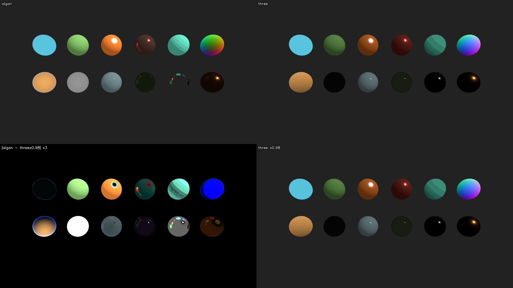

# Algan vs Three.js — a rendering audit

Two renderers, one scene description, the same frame. Where they disagree, this
asks which one is closer to the physics, and fixes the cases where Algan is not
and the fix is contained.

Everything here was measured on this machine (a CPU-only cloud session,
Ubuntu 24.04, 4 vCPU, no GPU — so Algan ran its CPU path throughout). Nothing is
quoted from memory or from a design document without saying so.

Part of the work is Ox Alpha's, run as a subagent through OpenCode: it wrote
`three_render.mjs` (the Three.js back end, both modes), the independent
source-level audit in `OX_AUDIT.md`, the Charlie-sheen helper functions in
`shading_taichi.py` — whose coefficients this audit then checked against the
installed Three.js r185 source and found exact — and the volumetric-absorption
implementation of §4.6. Where its conclusions and this document's differ, §2.1
and §4.9 say so and why.

The third run's split was the same and worked the same way. Ox Alpha wrote both
back ends' new material and light types, the two scene files, the source-level
audit in `OX_MATLIGHT_AUDIT.md` — which is where the band-edge, matcap and
view-space normal comparisons come from, each cited to a line of the installed
r185 source — and the four in-kernel stages of §6.2. The measurements, the
experiments that produced them, and every claim in this section are this
document's own: §6.3 in particular is a defect Ox's audit did not find, because
it comes from reading a rendered pixel against the value the shader computed
rather than from reading either engine's source.

**This is the second run.** The first run's §2.2 (no colour management) has been
acted on since, by the linear-working-space change, and the point of re-running
was to find out whether the two open items it left — §2.2 and §4.6 — had closed.
One had, half way: §2.2 is now genuinely fixed, but the re-run found the linear
space was only decoding one of the three routes an authored colour takes into
the renderer, and until this run an authored 0.5 grey rendered 188. That, and
§4.6, are what moved; everything marked **[2]** below is new or re-measured in
this run.

**The third run added §6**, and it is a different kind of addition: the first
two runs audited *transport* — glass, mirrors, shadows, colour — on scenes
written for this suite. The third audits *materials and lights*, by porting one
of the render suite's own scenes,
`tests/full_renders/scenes/materials_and_lighting.py`, into the spec. Six
material types and three light types are new to `SPEC.md`, and everything
marked **[3]** below comes from them. It found four discrepancies, all of them
new defects rather than known conventions; three are fixed here and the fourth
is specified. The largest was that four of Algan's twelve material classes
were not being shaded at all under this scene's lighting rig.

## What it found, in one table

| # | Discrepancy | Algan worse? | Done |
| --- | --- | --- | --- |
| §2.2 | **[2]** The linear working space encoded output but decoded only per-vertex colour — a promoted uniform colour, a colour texture and every material-block tint went undecoded. An authored 0.5 grey rendered 188 | yes — the biggest one | **fixed** — the transfer curve is the identity again |
| §4.6 | **[2]** `attenuation_color` / `attenuation_distance` accepted and dropped: coloured glass had no depth | yes | **fixed** — now within 0.003 of the path tracer on every channel |
| §4.1 | A clear glass sphere cast a shadow as dark as an opaque one — 1.0% of the open floor where the reference passes 101.9% | yes, badly | **fixed** — 85.1% |
| §4.2 | Fresnel used the wrong angle leaving a dense medium; at total internal reflection the energy went to the transmitted branch, tinted | yes | **fixed** against the exact equations |
| §4.3 | A per-light transmission glow was added on top of the traced refracted ray | yes | **fixed** — disc 82.4 → 52.7/255 |
| §4.4 | Sheen was `(1 − n·v)^k` with no `n·l`: a light behind the surface still lit its rim | yes, worse than both references | **fixed** — Charlie × Neubelt, rim 109 → 3/255 |
| §4.7 | Two `SETTINGS.raytracing` fields no renderer reads, accepted silently | yes | **fixed** — writing raises |
| §4.5 | **[2]** A rough metal reflects 4.7% of what it should by default; `glossy_reflection=True` gets the energy right (0.555 against 0.523) but its four taps speckle | yes | not flipped — §4.5 measures what the tap count can and cannot buy, and what would actually fix it |
| §6.2 | **[3]** `MeshToonMaterial`, `MeshNormalMaterial`, `MeshMatcapMaterial` and `MeshDepthMaterial` have no in-kernel port, so a rig without a plain `PointLight` leaves them unshaded — four flat discs, disc variance exactly 0.0000 | yes — the biggest one this run | **fixed** — each has an in-kernel stage now: every light type, per fragment, shadows received |
| §6.3 | **[3]** A packed normal and a depth ramp went out through the sRGB OETF, which three.js pointedly does not do to either | yes | **fixed** — red and green now match three.js to the byte; only the world-vs-view-space channel is left |
| §6.4 | **[3]** Phong's specular lobe has no `(shininess·0.5+1)·0.25` normalization, no multiplicative `n·l` and no Fresnel — the one lit material whose ratio to three.js is not a uniform π | yes | **fixed** — three.js's `BRDF_BlinnPhong` term for term, pinned by a unit test against the analytic formula |
| §6.7 | **[3]** `RectAreaLight` is a mean of point samples, not a solid-angle integral: with the default `decay = 0` it has no distance falloff at all, so it floods a wall where the reference pools under the rectangle (32× under the light, 145× at the wall's edge) | yes — not a unit convention, a falloff shape | not fixed — the correction is specified in §6.7 and needs its own baselines |
| §2.1 | Diffuse missing `1/π` | **no** — a light-unit convention, now measurable as exactly π (§6.6 measures it as 3.15 at every pixel of a hemisphere-lit wall) | left alone, on purpose |
| §4.8 | **[2]** A flat ambient on every lit surface, 0.01 in linear light | yes, but an artistic default | left alone |
| §4.10 | **[2]** Coloured glass casts a grey shadow where the reference's is green | yes | **fixed** — the payload is RGB; green/red 1.00 → 22.3, and the falloff across three sphere sizes matches Beer-Lambert |
| §3 | Refraction, mirror reflection, clearcoat, bounce exhaustion | **no** — refraction beats stock Three.js outright | — |

---

## 1. How the comparison was set up

`SPEC.md` defines a small JSON scene format — camera, lights, spheres and boxes,
`MeshPhysicalMaterial` parameters — chosen so that both engines can express every
field *exactly*. Two back ends consume it:

| back end | what it is | file |
| --- | --- | --- |
| `algan` | Algan's own renderer via `Scene.save_frame` | `algan_render.py` |
| `three_raster` | `THREE.WebGLRenderer` r185, out of the box | `three_render.mjs` |
| `three_pathtrace` | `three-gpu-pathtracer` 0.0.24 on the same scene graph | `three_render.mjs` |

The path tracer matters: Three.js's rasterizer cannot reflect a scene without an
environment map and cannot refract at all, so on exactly the questions this audit
is about it is not a reference. `three-gpu-pathtracer` path-traces the *same*
`MeshPhysicalMaterial` objects, so it is the physically-based reading of the same
material description. Where the two Three.js modes disagree, the path tracer is
the reference and the rasterizer is reported as context.

Three.js ran with its defaults and no fudging toward Algan:
`ColorManagement.enabled = true`, `outputColorSpace = SRGBColorSpace`,
`toneMapping = NoToneMapping`, shadow maps on in the raster pass. Scene colours
are fed through `Color.setRGB(r, g, b, SRGBColorSpace)`, so an authored `0.8`
means the sRGB value `0.8` on both sides.

Algan ran with `SETTINGS.raytracing.set(shadows=True, tonemapping=False)`. Shadows
because Three.js has them on and Algan defaults them off; tonemapping off because
that is what Three.js defaults to — and, since the first run, what Algan defaults
to as well, so the flag is now belt-and-braces rather than a correction. With both
off, the only transfer function in play is the sRGB OETF at the byte write, which
both engines apply.

Algan's tonemapper was checked against the Khronos curve and is a faithful
implementation of it. It now sits in the right place as well as being the right
curve: under the linear working space it takes linear input and the OETF runs
after it, which is three.js's order (`tonemapping_fragment` then
`colorspace_fragment`). Measured on a flat slab, an authored 0.5 grey renders
**116** with the curve on and 128 with it off — `encode(neutral(linear(0.5)))`
predicts 117 — and an authored 0.1 renders **2**, because linear 0.01 is
genuinely near-black and PBR Neutral's 0.04 pedestal is scaled for scene-referred
values. That is parity, not a discrepancy: three.js does the same thing to the
same input. It is also a reason the default is off, and §2.2 is what made it a
faithful composition rather than a curve applied to already-encoded numbers.

### Two things had to be reconciled before any pixel comparison meant anything

**Algan's +z axis points into the screen.** `OUT`, the direction out of the screen
toward the viewer, is `(0, 0, -1)`, and a new Scene's camera sits at `z = -7`.
Three.js and glTF have the opposite sign. Porting a scene means negating every z
coordinate, every z direction, and every rotation about y. The docstring in
`algan/constants/spatial.py` said the opposite ("``OUT``/``IN`` along +z/-z") and
has been corrected as part of this work, along with the same claim in
`shapes_3d.py`.

**Algan's default Scene comes with a light.** `default_scene_initializer` spawns a
white `PointLight` beside the camera. Every scene here replaces the initializer
with one that spawns only the camera, so both engines see exactly the lights the
spec names.

With those settled, `scenes/calib_orient.json` — five unlit boxes, one per signed
axis — renders **identically** in the two engines: the same silhouettes to the
pixel, the same depth order, mean absolute difference 1.29/255 against the
rasterizer, confined to antialiased edges. Camera, field of view, projection and
handedness agree exactly, so everything that follows is shading and transport,
not geometry. Since §2.2 the exposure factor between them is **0.96** as well —
unlit content now matches in absolute value, not only in shape, which is the
sharpest single statement of what that fix bought.


---

## 2. The two global conventions that differ (and why only one is a defect)

`scenes/calib_diffuse.json` is one 0.8-grey roughness-1 metalness-0 sphere lit
head-on by a single white directional light of intensity 1, on black. The centre
pixel is a direct readout of each engine's diffuse convention:

| | centre pixel | as linear radiance |
| --- | --- | --- |
| Algan, first run (tonemapping off) | 217 | 0.673 |
| **Algan, this run** | **202** | **0.591** |
| Three.js raster | **122** | 0.195 |
| Three.js path tracer | 108 | 0.150 |

Three.js's number is exactly what theory says: `srgb_to_linear(0.8) / π = 0.192`,
encoded back to sRGB as 121. Algan's is now `srgb_to_linear(0.8) × (0.01 ambient
+ 0.96 k_d) + specular = 0.589` against 0.591 measured, encoded as 202.

Two independent differences produced the first run's gap. One was a defect and is
fixed (§2.2); the other is a convention and is left alone (§2.1). With the defect
gone the convention is measurable on its own for the first time.

### 2.1 The missing 1/π is a unit convention, not an error

Algan's diffuse term is `k_d · albedo · light_colour · n·l`, with no `1/π`.
Three.js uses `albedo/π`. In linear terms Algan is π× brighter for the same
intensity number: **0.591 / 0.195 = 3.03** against a predicted 3.14, the 3%
remainder being Algan's `k_d = 1 − F = 0.96` at normal incidence. (The first run
measured this ratio as 3.17 and this run, before §2.2 was fixed, as 3.99 — both
contaminated by the missing decode. 3.03 is the first clean reading.)

It is tempting to call that a bug, and Ox Alpha's independent audit
(`OX_AUDIT.md`, finding 1) ranks it first. **I disagree, and this is worth being
precise about.** A constant factor between two renderers is a choice of light
unit, not a physical claim: Algan's `DirectionalLight(intensity=1)` simply means
"irradiance π", i.e. "a white surface facing this light comes out white". Nothing
observable distinguishes that from Three.js's convention except the number the
user types. The renderer's own settings agree — `SETTINGS.raytracing.light_intensity`
defaults to π for exactly this reason.

Dividing the diffuse term by π *on its own* would make every existing Algan scene
3.14× darker and no more physically accurate. It is only worth doing as part of
2.2, which is a real defect, and where the two changes partly cancel.

### 2.2 Colour management — FIXED, but not by the change that was supposed to fix it

The first run's finding was that Algan had no colour management at all: an
authored colour was written out unchanged, so lighting arithmetic ran on
display-referred values and a Lambertian falloff came out as `n·l^2.2` on screen.
The linear working space landed since, and the falloff is now right — the shape
of the terminator on `calib_diffuse`, sampled at fractions of the sphere's screen
radius and normalised to the centre, agrees with Three.js's rasterizer to within
half a percent:

```
r/R                     0.0    0.2    0.4    0.6    0.8    0.9   0.95
Algan                 1.000  0.990  0.954  0.881  0.746  0.627  0.529
Three.js raster       1.000  0.994  0.953  0.882  0.749  0.630  0.535
```

**But the decode was only reaching one of the three routes a colour takes into
the renderer**, and it was the least-used one. `transfer_probe.py` renders a flat
slab at a series of authored greys and reads the centre pixel; at the start of
this run it read:

```
authored               0.05  0.10  0.20  0.30  0.40  0.50  0.60  0.70  0.80  0.90  1.00
as 8-bit                 13    26    51    76   102   128   153   178   204   230   255
unlit, no tonemap        63    89   124   149   170   188   203   218   231   243   255   <- encode(authored)
```

That row is exactly `linear_to_srgb(authored)`: the OETF was being applied at the
byte write with **no matching decode at ingest**. The first run predicted this
failure mode in as many words — "a partial fix is worse than none: decoding
albedo without encoding output, or vice versa, moves everything the wrong way" —
and it is what shipped.

Three things reach the kernel as authored colour, and only the first was decoded:

1. **per-vertex colour arrays** (`tri_colors`, `circuit_colors`,
   `circuit_border_colors`) — decoded by `_decode_merged_colors`;
2. **colour texture maps** — and this is not a corner case. With
   constant-property promotion on (the default), a mob whose colour and material
   are uniform is rendered from a shared **1×1 colour map** in
   `scene["textures"]` instead of per-vertex rows, so *most* content arrives this
   way. On `calib_diffuse` the merged scene held three all-zero `tri_colors` rows
   and the sphere's real 0.8 grey sat in `textures`. Real image textures
   (`ImageMob`, `set_texture`) took the same undecoded route;
3. **the material parameter block's colour slots** — `emissive`, `specular`,
   `specular_color`, `sheen_color`. An unlit slab authored emissive
   (0.5, 0.25, 0.75) rendered (188, 137, 225) instead of (128, 64, 191): too
   bright, and hue-shifted, because the error is per channel and non-linear.

The A/B that pins (2) needs no instrumentation: `ALGAN_PROMOTE_CONSTANTS=0`
rendered the same slab at **128** where the default rendered **188**, because
turning promotion off puts the colour back on the route that was decoded.

Both are fixed. Colour maps decode as they are appended
(`_append_texture(..., is_color=True)`) rather than on the assembled buffer,
because a promoted map can share storage with the per-vertex rows it was sliced
from; material and normal maps are declared not-colour by their caller and are
left alone, and the material block decodes only for primitives on a built-in
pipeline, since a custom fragment pipeline's block is its own layout. After:

```
authored               0.05  0.10  0.20  0.30  0.40  0.50  0.60  0.70  0.80  0.90  1.00
as 8-bit                 13    26    51    76   102   128   153   178   204   230   255
unlit, no tonemap        13    26    51    77   102   128   153   179   204   230   255   <- identity
one directional light    20    30    53    77   102   127   152   177   202   227   252
```

The unlit row is the identity again, and the lit row is now *also* essentially the
identity — which is Algan's light-unit convention (§2.1) stated in one line: a
white surface facing a `DirectionalLight(intensity=1)` comes out the colour it
was authored. The 10/255 floor at authored zero is §4.8's ambient fill.

**This moves every pixel of every render**, so it invalidates the committed
baselines. `tests/fast`'s CPU baseline was regenerated here and verified to
re-pass; the CUDA fast baseline and both `tests/full_renders` sets need
regenerating on the machines that own them (this session is CPU-only, and the
full-render baselines are per machine).

The old and new baselines side by side are the clearest statement of what the
defect was doing (frame 30 of `tests/fast`, old left, new right):


The three-dimensional meshes are authored `ORANGE`, `RED` and `TEAL`, and on the
left they are pale yellow, pale pink and pale mint — every uniformly-coloured mob
washed out by an unmatched encode. The 2-D circuits beside them barely move,
because circuit colour was on the one route that *was* decoded. That split is the
diagnosis, drawn.

---

## 3. Where Algan is already right

Worth stating plainly, because the rest of this document is a list of problems.

**Refraction is genuinely traced, and it is correct.** `scenes/calib_glass.json`
puts a clear ior-1.5 sphere in front of four coloured blocks. Algan produces the
inverted, magnified image a real glass ball produces, with the four-pointed dark
star where total internal reflection takes over at the rim — and it matches the
path tracer's structure closely enough to overlay.


Three.js's **rasterizer cannot do this at all**: its `transmission` samples the
framebuffer behind the object, so the blocks appear the right way up, unrefracted.
On this axis Algan out-performs stock Three.js by a wide margin and matches the
path tracer. Quantitatively, the fraction of the backdrop's brightness that
survives the trip through the ball is **0.913** in Algan against **1.001** in the
path tracer — the reference exceeds 1 because the ball is a lens and concentrates
what it passes, which is the part Algan's single refracted ray per pixel cannot
reproduce.

**Mirror reflection is accurate.** On `scenes/calib_mirror.json`, the fraction of
the floor's brightness that survives reflection in a smooth metalness-1 sphere is
**0.900** in Algan against **0.879** in the path tracer (the material's albedo is
0.95). Three.js's rasterizer scores 0.0 — with no environment map a mirror has
nothing to reflect.

**Clearcoat matches the real-time reference.** Algan adds the coat lobe without
attenuating the base layer, which the glTF spec says to do — but Three.js's own
WebGL renderer does not attenuate it either. Algan is not worse than the reference
it is modelled on.

**Bounce exhaustion degrades gracefully.** At `max_bounces`, the reflection share
falls back into local shading rather than contributing black.

---

## 4. Discrepancies, ranked, with what was done about each

### 4.1 A transmissive solid casts a fully opaque shadow — FIXED

`scenes/calib_shadow.json` puts a clear glass sphere and an opaque sphere of the
same size side by side over a floor, lit straight down, so each shadow sits
directly beneath its sphere and the two are trivial to compare.

| | glass sphere's shadow | opaque sphere's shadow |
| --- | --- | --- |
| Algan, before the fix | **1.0% of the floor** | 1.0% |
| Algan, after (first run) | 85.1% of the floor | 1.0% |
| **Algan, this run** | **92.4% of the floor** | 1.0% |
| Three.js path tracer | 102.6% of the floor | 4.2% |
| Three.js raster | 0% | 0% |

(The glass patch moved from 85.1% to 92.4% between runs because §2.2 changed the
floor's albedo *and* the fraction of it the shadow keeps is measured against that
same floor — what a correct decode changed is the denominator's linearity, not
the shadow march.)

(Linear radiance, each shadow patch as a fraction of the open floor. The glass
patch exceeds 100% in the path tracer because the sphere is a lens and
concentrates light.)

Algan's glass blocked light **exactly as completely as an opaque sphere of the
same size**. The shadow march attenuated by coverage alone —
`transmitted *= 1.0 - alpha` — and never consulted `transmission` or `ior`, so a
window, a wine glass and a brick were the same object to a shadow ray. This was
the single largest structural error found.

Now each shadow-ray hit passes `transmission · (1 - metalness) · (1 - F0)` of the
light it covers. `F0` is the normal-incidence dielectric reflectance rather than
a real angle-dependent Fresnel — the march has no normals and fetching them
would cost the hottest loop in the renderer for a second-order effect — and it is
less of an approximation than it sounds, because a solid presents the march two
surfaces, entry and exit, each taking its own `1 - F0`.

Two things it deliberately does not do, both because the shadow payload is one
scalar per light: it does not bend the light (so there is no caustic core), and
it does not tint it (so the shadow under green glass gets brighter but stays
grey, where the path tracer's turns green). "A transmissive surface stops
blocking light" is the honest description, not "glass casts a correct shadow".

The any-hit shadow fast paths had to be gated: modes 2 and 3 answer "is anything
there" and treat a hit as full occlusion, which stopped being equivalent to the
march once a covered surface can pass light — and a glass ball is `alpha = 1`, so
it does not even register as translucent. A batch containing transmissive
geometry now stays on the ordered march. Scenes without any keep their fast path
and their pixels: `calib_mirror.algan.png` is **byte-identical** across the change.


### 4.2 Fresnel was evaluated on the wrong side of a glass surface — FIXED

`_material_reflectance` applied Schlick's approximation to `abs(rd · n)`
regardless of which side of the interface the ray was on. Schlick is written for
a ray arriving from the thin side; a ray already inside glass reflects far more
than the same incident angle suggests, and past the critical angle it reflects
everything. Measured against the exact Fresnel equations at ior 1.5:

| angle inside the glass | before | after | exact |
| --- | --- | --- | --- |
| 20° | 0.040 | 0.040 | 0.042 |
| 35° | 0.040 | 0.067 | 0.086 |
| 40° | 0.041 | **0.246** | **0.245** |
| 41.8° (critical) | 0.041 | 0.908 | 0.891 |
| 45° | 0.042 | **1.000** | **1.000** |
| 80° | 0.410 | 1.000 | 1.000 |

So light leaving a solid was split six-to-one the wrong way just below the
critical angle, and beyond it, energy that should have been perfectly reflected
was passed through the surface instead. Worse, `_refract_ray` *did* detect total
internal reflection and bent the ray into the mirror direction — but the ray
carried the **transmitted** weight, which is tinted by the glass colour, so a
perfectly achromatic Fresnel reflection came out coloured.

The fix follows KHR_materials_volume's three normative cases: entering, Schlick
on the incident angle; leaving without TIR, Schlick on the air-side angle; leaving
past the critical angle, `F = 1` with the transmitted branch given zero weight.

**Scoped so nothing else moves**: the side test is gated on `transmission > 0`.
The renderer does not track which medium a ray is in, so "the far side of the
surface" is inferred from the normal — sound for a closed transmissive solid,
wrong for a back-facing hit on an ordinary opaque surface, which is not inside
anything. Verified: `calib_mirror.algan.png` is **byte-identical** across the
change (same md5), while `calib_glass` moves, and moves only in a ring at the
sphere's rim and along the arms of the TIR star — exactly where the exit-side
Fresnel acts.

`tests/unit_tests/test_dielectric_fresnel.py` pins all of this against the exact
Fresnel equations, including that an opaque material stays side-blind.

### 4.3 Transmission was counted twice — FIXED

`_stage_physical` added `rgb * lc * (transmission * (1 - metalness) * 0.5)` inside
its per-light loop — a glow proportional to transmission, with no `n·l`, scaling
with the number of lights — on top of the real refracted ray that the scatter
already traces. Glass lit from behind its own horizon still gained it.

The term is not needed even in the cases where no refracted ray is spawned (an
index-matched `ior ≤ 1`, or a batch built without the split pool): the
transmitted share then continues unbent as part of the pass-through
(`pass_w = cover3 + trans_energy * tint`), so the light behind the surface still
reaches the pixel. Meanwhile the stage's own output is already scaled by
`alpha * (1 - R - trans_share)` to make room for it. Removed from both the
Taichi stage and its torch twin.

Measured on a `transmission = 0.75, ior = 1.5` sphere under two point lights,
the mean over its disc drops from **82.4/255 to 52.7/255** — the surface stops
glowing in the lights' colour and shows what is behind it instead.

### 4.4 Sheen was an ad-hoc rim, not a BRDF — FIXED

`sheen * (1 - n·v)^k`, with no `n·l`, no distribution, no normalisation and no
effect on the layer underneath. Replaced with what glTF's KHR_materials_sheen
and Three.js's `BRDF_Sheen` specify, term for term: the Charlie distribution
(Estevez & Kulla 2017), the Neubelt visibility term, `n·l`, and the base-layer
energy compensation `1 − max3(sheenColor) · max(E(n·v), E(n·l))` that stops the
fibre layer adding light the base already spent. The formulas were taken from
the installed Three.js r185 source rather than from memory.

The decisive test is a light placed **behind** the sphere, where a physical
sheen lobe must contribute nothing. Mean rim RGB, and its 99th percentile:

| | rim mean | rim p99 |
| --- | --- | --- |
| before, light in front | (41.1, 30.5, 39.3) | (113, 72, 97) |
| after, light in front | (34.8, 26.2, 33.6) | (46, 31, 40) |
| before, light behind | (29.7, 19.2, 25.7) | (109, 68, 92) |
| **after, light behind** | **(3.0, 3.0, 3.0)** | **(3, 3, 3)** |

With the light behind, the rim now sits at the flat ambient floor (§4.8) instead
of blazing at 109/255. With it in front the lobe is still there but no longer
spikes into a hard bright ring at the silhouette.

Every material that leaves `sheen` at its default is untouched, and provably so:
`sheen = 0` makes the compensation exactly `1.0` and the lobe exactly zero, and
a `MeshPhysicalMaterial` sphere with sheen and transmission at their defaults
renders **byte-identically** across both fixes (same md5).

### 4.5 A rough metal reflects almost nothing — NOT FIXED, but the reason to leave it off is now measurable

Measured on `calib_mirror`, the fraction of the floor's brightness reflected by a
metalness-1 roughness-0.35 sphere:

| | reflection efficiency |
| --- | --- |
| Algan, default settings | **0.047** |
| Algan, `glossy_reflection` on | **0.555** |
| Three.js path tracer | **0.523** |
| Three.js raster (no env map) | 0.042 |

By default a rough metal in Algan reflects **4.7%** of what it should — a factor
of 11. With `SETTINGS.raytracing.set(glossy_reflection=True)` it lands within 6%
of the path tracer, which is as close as this audit measures anything.

The energy is thrown away on purpose. `_mirror_share` scales the Fresnel lobe by
the GGX CDF mass inside a narrow cone, so a single mirror ray carries only the
share of the lobe it can honestly stand for — ~3% at roughness 0.35 — and the
rest falls back to the surface's own shading. For a *metal* that shading has no
diffuse term at all, so what it falls back to is the ambient fill: §4.8's 0.01.
The throttle and the linear working space compound, which is why this is a real
number rather than a rounding error.

**The reason it ships off is a motion artefact, and this run tried to measure
it.** `settings.py` argues that four secondary taps cannot integrate a wide GGX
lobe: the interleaved variant resolves into an ordered dither that crawls as
geometry moves under a screen-fixed pattern, and the plain variant lands as four
discrete ghost copies. Three measurements:

**How many taps you can ask for.** `ALGAN_ANALYTIC_AA_SECONDARY` is a live env
int, so "just use more taps" is a one-line experiment — except that
`analytic_aa_secondary_samples()` **snaps it to 8, 4 or 2**, silently, because
the sub-pixel positions are a compile-time table. 16 and 32 are accepted and
render exactly as 8:

```
  taps  efficiency   speckle   seconds
   off      0.0468    0.0653      15.9
     4      0.5546    0.1905      36.5
     8      0.5555    0.1334      65.4
    16      0.5555    0.1334      21.9      <- identical to 8
    32      0.5555    0.1334      21.3      <- identical to 8
```

**Update: fixed** (work-queue item 3). Two things capped it, and only fixing
both helps: the position table had entries at 1/2/4/8 only, *and* each of the
eight coverage samples owned its single nearest position, so no fragment could
own more than eight positions however long the table was. Counts outside the
hand-written four now generate their positions from a Hammersley set and assign
each position to its nearest coverage sample (the inverse of the old rule, used
only above eight — the two rules disagree on 208 of the 256 coverage masks at
`n = 8`, so swapping it wholesale would have moved the default). Re-measured on
the same scene, with a prefiltered row for comparison:

```
  taps  efficiency   speckle  contrast   seconds
   off      0.0468    0.0653    2.7060      22.8
   pre      0.2594    0.0293    0.7741      24.7
     4      0.5546    0.1905    0.7443      24.4
     8      0.5555    0.1334    0.7404      42.5
    16      0.5566    0.0865    0.7338      94.9
```

4 and 8 reproduce their historical rows exactly, and **16 is now a different
render**: speckle 0.1334 → 0.0865, for 2.2x the time. Which is also the point
the section makes — 16 taps buys a `sqrt(2)` improvement in the residual and
costs more than double, where the prefiltered row is smoother than any of them
(0.0293) at the four-tap price.

Two honest readings of that `pre` row. Its **speckle is the lowest measured
anywhere in this audit**, reference included (the path tracer's is 0.373 — it
is Monte Carlo). Its **efficiency, 0.2594, is half the reference's 0.523**, and
that is the screen-space limit showing: `calib_mirror`'s ball is small and its
lobe at roughness 0.35 is 14 degrees wide, so the prefilter's footprint covers
most of the ball's own screen area and averages the parts of it that reflect
black background together with the parts that reflect floor. A per-point
hemisphere integral does not. The fan's 0.555 is not "more correct" here — it
is one-tap-per-direction on the same lobe with the energy unthrottled — but on
this measurement it lands closer, and a small reflector under a wide lobe is
where the screen-space route is weakest.

(`speckle` is the RMS of the ball's high-pass residual over its own mean;
`seconds` is wall clock on a contended 4-vCPU box and should be read as an order
of magnitude, not a benchmark.)

**How the residual compares with the reference.** The same measurement on
Three.js's path tracer at 64 samples gives **0.373** — nearly three times Algan's
8-tap 0.133. Algan's deterministic glossy reflection is not noisier than the
ground truth it is being compared against; the ground truth is Monte Carlo.

**Whether it crawls — and the setting's comment is right.** The crawl mechanism is
a screen-fixed pattern, so it shows up when geometry slides across pixels.
`glossy_probe.py --crawl` renders a scene twice with the camera nudged **half a
pixel** and reports how much the reflecting content changed as a fraction of its
own brightness. The control is the same measurement with glossy off, where a
mirror ray's direction is a smooth function of position and a half-pixel move
should barely register. `scenes/calib_glossy.json` was added this run to be the
case `settings.py` describes — a rough metal wall whose only light is the
reflection of one small bright emitter:

| | `calib_mirror` (broad floor) | `calib_glossy` (small bright source) |
| --- | --- | --- |
| glossy off (control) | 0.0061 | **0.0001** |
| glossy, interleaved (default) | 0.0062 | **0.0320** |
| glossy, plain fan | 0.0063 | **0.0331** |

On a broad low-contrast reflector, glossy sampling adds nothing at all. On a
small bright source it moves the image **320 times** as much as the control for
half a pixel of camera motion — which is the crawl, quantified. Whoever wrote
that comment had it exactly right, including that it is the high-contrast case
that shows it.

The renders say the same thing more directly than any number:


The path tracer's reflection is a soft glow. Algan's default is a *sharp dim
dot* — the mirror-share throttle rendering a rough metal as a faint mirror. The
plain fan is eight discrete ghost copies of the emitter, and the interleaved
variant is a regular grid of dotted blocks: the 4×4 Bayer tile, unfiltered. Both
glossy arms have the right total energy and neither has the right shape.

#### 4.5.1 What would actually fix it — NOW BUILT

**Update: this is implemented.** `glossy_reflection` now selects the split-sum
route described below by default, and the tap fan only on request
(`set(glossy_reflection=True, prefilter=False)`). The design of record is
`algan/rendering/raytracing/DESIGN_glossy_prefilter.md`; what the section below
specified is what was built, with one scoping decision worth naming — **one
prefiltered glossy event per pixel**, the first sheet that qualifies, with every
later reflective sheet and every deeper bounce keeping the `_mirror_share`
throttle.

The crawl measurement that closed §4.5 is the one that reopens it, on the same
scene and at the same half-pixel camera nudge:

| | `calib_glossy` (small bright source) |
| --- | --- |
| glossy off (control) | 0.0001 |
| **glossy, prefiltered** | **0.0005** |
| glossy, interleaved fan | 0.0320 |
| glossy, plain fan | 0.0331 |

64x less motion than either fan, and within a factor of five of a control that
draws almost nothing at all. The remaining 0.0005 is the reflection ray's own
hit point sliding across geometry, which is the same thing the control's 0.0001
is and is what a deterministic mirror ray has always done.

`out/calib_glossy.compare.jpg` is the shape half of the answer: the prefiltered
panel is a soft glow with a core, against the path tracer's soft glow with a
core, where the plain fan is eight discrete copies of the emitter and the
interleaved one a grid of Bayer blocks. Its brightness is not comparable across
engines (§2.1) but its **shape** is, and the shape is what four taps could not
get.

Two traits of the built version that the specification below did not anticipate:

* **It is screen space, so a rough metal reads darker than it used to.** With
  the throttle a metal keeps its ambient fill in place of the reflection it
  declines to draw; with split-sum that energy is spent on the reflection, and
  the reflection of a nearly black room is nearly black. On `calib_glossy` the
  wall's own shading drops to `1 - E` = 0.34 of what it was. That is the correct
  answer and it is also a visible change: pair it with an environment map.
* **The blur radius is discontinuous where the reflected content is.** Contact
  hardening scales the radius by how far past the reflector the reflection
  landed, and that distance jumps at the silhouette of whatever is being
  reflected, so the filter width jumps with it. Prefiltering the radius field
  itself would smooth it; nothing does today.

The original specification follows.

Worth stating plainly, because "use more taps" is the obvious move and it is the
wrong one. The variance of a stratified estimator falls as `1/sqrt(k)`; going
from 4 taps to 32 buys a factor of 2.8 and costs 8× the secondary rays, and it
still does not make a wide lobe clean. More fundamentally, the artefact the
throttle exists to prevent is **minification aliasing** — a reflected image
compressed into a few pixels — and no amount of point sampling fixes minification
aliasing. Prefiltering does.

Every renderer that gets a wide glossy lobe from one deterministic ray uses the
**split-sum approximation** (Karis 2013):

    ∫ L(l) f(l,v) dl  ≈  [ ∫ L(l) D(l) dl ] · [ ∫ f(l,v) dl ]
                          prefiltered radiance   BRDF integral (DFG)

* The **second factor is analytic** — the environment-BRDF term `F0·A + B`, a
  2-D function of `(n·v, roughness)`. It is the exact directional albedo of the
  lobe, it costs no rays, and it is what `_mirror_share` is standing in for with
  a heuristic. Swapping the heuristic for the analytic term fixes the energy
  outright.
* The **first factor needs a prefiltered radiance**, which an IBL renderer gets
  from a roughness mip chain of its environment map. A ray tracer with no
  environment map has two ways to build one: **screen-space reflection
  filtering** — trace one ray per pixel in the dominant direction, write its
  radiance to its own buffer with the hit distance, and blur that buffer with a
  per-pixel radius set by the lobe's screen footprint before compositing — or
  **ray cones** (Akenine-Möller et al. 2019/2021), which need a prefiltered
  *geometry* representation Algan does not build. VXGI-style cone tracing and LTC
  are the other deterministic answers and need the same.

The screen-space route is the one that fits here, and it is worth noting it fixes
both halves at once: it is deterministic (the ray direction is a smooth function
of position, so nothing crawls), it costs a buffer and one separable pass rather
than any extra rays, and the blur it applies is exactly the prefilter the
minification aliasing needs. In Algan the contained form is a **first-bounce
glossy reflection buffer**: when a primary hit spawns a reflection continuation
above a roughness threshold, give it the full split-sum energy, set its
throughput to 1 and route its accumulation to a second per-pixel buffer, keeping
the factored-out throughput and the blur radius in two more; after the wavefront
drains, composite `A + W · blur(B)`. Deeper glossy bounces keep the present
throttle — one glossy event per pixel is what the separation can represent, and
it is the one that matters.

One more thing worth recording, because it is half-built already: `GLOSSY_INTERLEAVE`
applies a 4×4 Bayer rotation per pixel. That is **interleaved sampling** (Keller &
Heidrich 2001), which is a two-part technique — N samples per pixel offset from an
n×n tile, *followed by a reconstruction filter over that tile*. Algan implements
the first part only, and the visible dither is what the missing second part is for.
The reconstruction pass needs the reflection isolated in its own buffer, which is
the same prerequisite as the split-sum route above.

None of this was shipped in the audit run itself. It is a renderer feature — new
arrays, a compositing pass, a settings gate, the memory model — not a patch, and
this audit measured it and specified it rather than half-doing it. It has since
been built to this specification; see the update at the head of this section.

### 4.6 No volumetric absorption — FIXED

`attenuation_color`, `attenuation_distance` and `thickness` were accepted by
`MeshPhysicalMaterial`, documented, and then **silently dropped** — they never
reached the GPU. Instead the transmitted ray was tinted by the surface albedo at
*every* interface crossing, so a coloured pane was tinted twice (entry and exit)
and a metre-thick block exactly the same as a thin shell.

`scenes/calib_absorption.json` makes that concrete: three glass spheres of radius
0.55, 1.05 and 1.75, identical material, against a bright backdrop. Because the
two engines disagree on light units (§2.1), the honest measurement is each
sphere's transmitted colour **as a fraction of the backdrop seen directly in the
same image**, which cancels them:

| radius | Algan, before | **Algan, after** | Three.js path tracer |
| --- | --- | --- | --- |
| 0.55 | (0.027, 0.443, 0.064) | **(0.004, 0.297, 0.015)** | (0.004, 0.300, 0.015) |
| 1.05 | (0.027, 0.442, 0.064) | **(0.001, 0.206, 0.004)** | (0.001, 0.207, 0.004) |
| 1.75 | (0.027, 0.443, 0.064) | **(0.000, 0.125, 0.001)** | (0.000, 0.124, 0.000) |

Before, Algan's three spheres were **the same colour to three decimal places**
whatever their size. After, they agree with the path tracer to within 0.003 on
every channel of every sphere — closer than Three.js's own rasterizer manages
(0.451 / 0.307 / 0.184 green), because the rasterizer drives absorption from the
material's `thickness` parameter and Algan, like the path tracer, uses the length
of the path the ray actually took.


The implementation is Beer-Lambert with glTF `KHR_materials_volume` semantics,
`transmittance(d) = attenuation_color ^ (d / attenuation_distance)`, packed into
the material block as an **absorption coefficient**
`sigma = -ln(linear(attenuation_color)) / attenuation_distance` rather than as
the two authored fields — which is what makes "no absorption" the all-zeros
value, the rule that block's zero-padding lives by. The log is taken after the
sRGB decode, matching three.js's decode-at-`Color` behaviour. The wavefront
bounce loop applies `exp(-sigma · d)` to the ray's throughput at a hit that
*leaves* a transmissive solid (`rd · n > 0`), with `d` the distance from the
surface the ray last crossed: for a refracted ray, spawned at the entry surface,
that is exactly its interior chord. Exact for a single convex solid; nested media
each attenuate over their own segment.

Independent of the reference, the numbers also match theory. The centre chords
are `2r` = 1.1 / 2.1 / 3.5 and `sigma_green = -ln(linear(0.85)) = 0.368`, so pure
Beer-Lambert predicts green transmittance ratios of 1.00 / 0.69 / 0.41 relative
to the small sphere. Measured: **1.00 / 0.69 / 0.42**.

### 4.10 Coloured glass cast a grey shadow — FIXED

`out/calib_absorption.compare.jpg`'s exposure-matched difference panel was
near-black over the spheres themselves and bright magenta under them, which
isolated what was left: the path tracer's glass spheres cast **green** shadows,
because what reaches the floor has been through the glass. Algan's were pale
rather than black — §4.1's fix lets the light through — but stayed grey,
because a shadow query returned one scalar per light.

The shadow visibility payload is now **RGB end to end** — producers, storage
and the shading stages — so a transmissive blocker can dim the channels
unequally. Two things then tint the light, and they are the same two the *view*
ray already applied, which is what makes a shadow agree with what the camera
sees through the same glass:

* **the albedo, at each interface**, matching `_scatter_impl`'s
  `trans_w = trans_energy * tint`; and
* **Beer-Lambert over the interior chord**, from §4.6's
  `sigma = -ln(linear(attenuation_color)) / attenuation_distance`, now carried
  to the shadow march in `tri_extra` columns 12-14.

The march has no normals, so it cannot use §4.6's `rd · n > 0` exit test. It
pairs hits instead: a fully-covering hit with non-zero sigma opens a medium or
closes the open one, and closing multiplies by `exp(-sigma · (t_exit - t_entry))`.
Exact for a single convex solid — the same guarantee §4.6 makes for the view ray.

`shadow_tint_probe.py` measures the result. Each sphere's shadow as a fraction
of the open backdrop, in linear light:

| radius | Algan, before | **Algan, after** | Three.js path tracer | Beer-Lambert |
| --- | --- | --- | --- | --- |
| 0.55 | (0.927, 0.927, 0.927) | **(0.014, 0.305, 0.025)** | (0.022, 0.398, 0.054) | (0.004, 0.294, 0.015) |
| 1.05 | (0.927, 0.927, 0.927) | **(0.011, 0.214, 0.014)** | (0.005, 0.278, 0.015) | (0.001, 0.204, 0.004) |
| 1.75 | (0.927, 0.927, 0.927) | **(0.010, 0.132, 0.011)** | (0.002, 0.168, 0.005) | (0.000, 0.122, 0.001) |

Before, the three shadows were **the same grey to four decimal places whatever
the sphere's size** — the scalar payload could carry neither the tint nor the
chord. After, green/red goes from 1.00 to 22.3 / 19.7 / 13.0, and the green
channel falls off across the three spheres as **1.00 / 0.70 / 0.43**, against
Beer-Lambert's predicted 1.00 / 0.69 / 0.41 and the path tracer's measured
1.00 / 0.70 / 0.42. That falloff is the whole content of the fix: it is what
§4.6 gave the view ray and what §4.10 was missing.

Everything still sits *below* the reference, and that residual is refraction:
the path tracer's sphere is a lens that concentrates light into its own shadow
(the same reason §4.1's clear-glass patch exceeds 100% there), which a march
travelling in a straight line cannot reproduce. So there is still no caustic
core — the umbra is uniformly tinted where the reference brightens toward the
middle. "Glass tints and absorbs the light it passes" is the honest
description; "glass casts a correct shadow" is not.

**One defect found by looking at the frame rather than the numbers**, recorded
because the numbers alone hid it. The pairing first used `alpha >= 1.0` to mean
"a solid's surface". A hit's alpha is the barycentric blend
`w0·a0 + w1·a1 + w2·a2` with `w0 = 1 - a - b`, and `(1-a-b) + a + b` is not
associative in f32, so the sum can land one ulp below 1.0 with every corner
alpha exactly 1.0. Such a hit fails to open (or close) the medium, and that ray
loses its **whole** absorption — never part of it, and only ever in the bright
direction:

| | small | medium | large |
| --- | --- | --- | --- |
| green relative deviation, `>= 1.0` | 5.8% | 14.5% | **28.2%** |
| green relative deviation, `_SOLID_COVERAGE_MIN` | 0.7% | 0.6% | 1.0% |

The pre-RGB renderer was uniform over the same disc to `std = 0.00000`, so on a
deterministic renderer any speckle at all is the defect. Widening the floor to
`1.0 - 1e-6` — the slack `_pack_frame_visibility` already uses to call a
primitive opaque — also moved the *mean* onto the Beer-Lambert line (large
sphere 0.142 → 0.132 against 0.122 predicted). That second effect is what
identifies the bright pixels as dropped chords rather than a sampling artefact,
and it is why a mean-only check misread this as a modest bias: measuring the
variance is what found it.

How large a share of barycentrics is affected depends on operand order and on
whether the backend contracts the blend into an FMA — a Python model in the
kernel's order says a few percent, the same model with two operands swapped
says under one — so the number is not quoted here. The A/B above is the
evidence that the floor needs slack, and it does not depend on the share.

`ALGAN_RGB_SHADOW_TINT=0` restores the achromatic shadow exactly. The payload
stays RGB either way; the gate covers only the tint and the absorption, so with
it off every channel carries the old scalar and the render is byte-identical
(`calib_mirror` renders to the same md5 on this branch and on stock `main`).

### 4.7 Two settings that silently do nothing — FIXED

`SETTINGS.raytracing.light_intensity` (default π) and
`SETTINGS.raytracing.ambient_light` are read only by `path_trace_physical_stbvh`,
a kernel `tracer.py` never launches — it is referenced only from a test. Setting
either had no effect on any render, silently. (`renderer_limitations.rst` already
said as much; the API just did not.)

Writing either now raises `AlganConfigurationError` naming what to do instead —
a light's own `intensity=` and an `AmbientLight` respectively. Reads still work,
because engine code binds the settings object and reads fields off it on the hot
path, and restoring a captured `SETTINGS.snapshot()` still round-trips them: a
snapshot is not a request to tune anything.

### 4.8 Algan adds an ambient fill to every lit surface — NOT FIXED (documented choice)

Every lit stage adds `albedo × AMBIENT_STRENGTH` with no light in the scene.
Three.js adds nothing without an ambient or environment light. So a fully
shadowed region in Algan can never go quite to black, and a black object glows
slightly. It stands in for the indirect light the deterministic path does not
compute (`indirect_bounce_strength` defaults to 0), and in a scene that *does*
have honest indirect light it double-counts.

The constant moved with the linear working space: **0.01 in linear light where it
was 0.1 display-referred**, which is the same fill in different units
(`srgb_to_linear(0.1) = 0.01003`). The transfer probe reads it as the 10/255 floor
at authored zero under one directional light.

This is an artistic default rather than a physics claim, and changing it would
darken every existing Algan scene. Left alone; recorded here so it is not
mistaken for a bug. It is worth knowing that it interacts with §4.5: for a
*metal*, which has no diffuse term, the ambient fill is the whole of what the
mirror-share throttle hands the reflected energy back to, so the two compound.

### 4.9 Two claims from the independent audit that did not survive checking

`OX_AUDIT.md` was produced by reading the source, not by rendering, and two of
its findings do not hold once measured. Recorded here so nobody chases them.

**"`samples_per_pixel > 1` silently switches the lighting model."** The switch
is real and large — the same scene's floor renders at 171/255 with
`samples_per_pixel = 1` and 20/255 with 4, because the Monte Carlo kernel has no
explicit lights and treats the vertex-shaded colour as emission. But it is not
silent. `docs/source/advanced_user_tutorials/renderer_limitations.rst` states
it in as many words — "`SETTINGS.raytracing.samples_per_pixel` selects the
renderer, not a quality knob" — with a table of what each renderer gives up. And
when the scene uses a feature the Monte Carlo path cannot honour, the render
refuses rather than producing a wrong frame: a directional light raises
`UnsupportedFeatureError: The Monte Carlo renderer selected by
samples_per_pixel > 1 cannot honor: extended lights`, naming the fix.

**"`glossy_reflection` is an experimental switch."** It is in `_PUBLIC_FIELDS`
alongside `shadows` and `max_bounces`; `SETTINGS.raytracing.set(glossy_reflection=True)`
is the supported spelling. (This audit had it wrong too, until the settings
module was read rather than guessed at.)

---

## 5. The main scene

`scenes/showcase.json` — mirror ball, clear glass sphere, tinted glass sphere,
rough gold sphere, clearcoat sphere, glass cube, sheen sphere, emitter, floor and
back wall, under a directional key and a blue point light.


After this run's two fixes the two images read as the same scene: the same floor
tone, the same wall, the same red and green and gold. The exposure factor needed
to match them is 2.10 rather than the 3.14 of §2.1, because the scene's ambient
fill and its several lights do not scale the way one head-on directional light
does. What the exposure-matched difference still picks out is the list of open
items and nothing else: the glass cube (Algan resolves it as thin panes where the
reference refracts it as a solid), the gold sphere's missing blurred surroundings
(§4.5), and the shadow under the green sphere (§4.10).

**The composite above predates §4.10's fix and has not been regenerated**, so
the green sphere's shadow in it is the old grey one. §4.10 measures the change
on `calib_absorption`, which isolates it; what a re-rendered showcase would add
is how it reads in a scene with several lights, and that has not been looked at.

---

## 6. The material zoo and the light zoo — **[3]**

The third run ported `tests/full_renders/scenes/materials_and_lighting.py` into
the suite. That scene exists to make shading the *only* variable — identical
spheres, one material each — and to be the one place the render suite exercises
every light type. Neither of those had a Three.js counterpart before, so
everything in this section is new coverage rather than a re-measurement.

It arrives as two scenes, because the ported original is an animation in four
acts and a spec is one still frame:

| scene | what it is |
| --- | --- |
| `scenes/materials_and_lighting.json` | act 1 — twelve identical spheres, one material class each, under an ambient + directional rig |
| `scenes/calib_lights.json` | act 3 — four neutral probes in front of a wall, one per new light type |

`SPEC.md` grew six material types (`lambert`, `phong`, `toon`, `normal`,
`matcap`, `depth`) and three light types (`spot`, `rect_area`, `hemisphere`)
plus a position+target spelling for `directional`. `material_probe.py` is the
new measurement: it projects each object in the *spec* into pixel space with
the spec's own camera and reports statistics per object, so the disc a number
is taken over is decided by the scene description rather than by finding blobs
in either image.

**Which reference answers which question, because it is not the same one
throughout.** §1 makes the path tracer the reference and says why: the
rasterizer cannot reflect without an environment map and cannot refract at all.
That reasoning still holds for anything about *transport*, and §6.5 and §6.7
use the path tracer accordingly.

It does not hold for the material-class questions, and there the rasterizer is
the reference instead. Algan's material classes are declared copies of
Three.js's (`materials.py`: "the same material types, property names and
default settings"), so for Lambert, Phong, Toon, Normal, Matcap and Depth the
question is not "what would physics do" but "what does the material three.js
defines do" — and `three-gpu-pathtracer` cannot answer that, because it has no
such materials. It converts every material to its own PBR model, so there is no
toon banding, no normal packing, no matcap and no depth ramp in it at all, and
it drops `AmbientLight` silently besides. On those columns the rasterizer is
not a weaker reference than the path tracer; it is the only implementation of
the thing being audited.

That is not an inference. Pointed at
`scenes/materials_and_lighting.json`, `three-gpu-pathtracer` **does not
render it** — it aborts while building its material table:

```
WARNING: path tracer does not support AmbientLight; ambient contribution is
  missing from this pass
TypeError: Cannot read properties of undefined (reading 'r')
  at MaterialsTexture.updateFrom (three-gpu-pathtracer/src/uniforms/MaterialsTexture.js:193)
```

It is reading `material.color.r`, and `MeshNormalMaterial` and
`MeshDepthMaterial` have no `color` — they are not surface descriptions.
Giving them one to get the pass to run would be inventing a reference for a
material the reference does not implement, so the back end does not.

Where the path tracer *is* the right reference, it is used: §6.7 puts it
against the rect-area light, and §6.5 against the four PBR spheres of row B,
rendered from a subset scene the path tracer can accept.

**One thing to know before comparing against the render suite's own frames.**
The audit harness replaces Algan's scene initializer with one that spawns only
a camera, so both engines see exactly the lights the spec names (§1). Algan's
*default* Scene ships a white `PointLight` beside the camera — and that light,
it turns out, is the only thing shading four of the twelve materials in the
committed baseline video. The audit's frames are not the baseline's frames, and
§6.2 is why.

### 6.1 The calibration anchor: `basic` is byte-identical

The unlit sphere renders **(88, 196, 221) in both engines**, at the centre and
as the mean over its disc, with a standard deviation of exactly zero on each
side. Authored colour in, the same eight-bit triple out. That is §2.2's
transfer curve holding on a second scene, and it means everything else in the
frame is shading rather than colour management or geometry.

### 6.2 Four materials are not shaded at all

`MeshToonMaterial`, `MeshNormalMaterial`, `MeshMatcapMaterial` and
`MeshDepthMaterial` have no in-kernel port. They are baked into vertex colours
before the frame renders, by a loop
(`RayTracedTrianglePrimitive._shade_vertex_colors`) that **skips every light
carrying `_render_aux`** — which is every light except a plain `PointLight`.
Under this scene's `AmbientLight` + `DirectionalLight` rig the loop body never
executes, the mob keeps its raw albedo, and the primitive packs the unlit
in-kernel material id.

The sharpest way to say it is the variance. Mean over each sphere's disc, and
the standard deviation of its linear luminance:

| | Algan mean | Algan std | three mean | three std |
| --- | --- | --- | --- | --- |
| toon | (92, 208, 179) | **0.0000** | (50, 120, 103) | 0.0324 |
| normal | (255, 255, 255) | **0.0000** | (71, 107, 227) | 0.0754 |
| matcap | (240, 172, 95) | **0.0000** | (175, 124, 67) | 0.0451 |
| depth | (255, 255, 255) | **0.0000** | (4, 4, 4) | 0.0000 |

A deterministic renderer that reports zero variance across a sphere under a
directional light did not shade it. Algan's means are not approximations of
three.js's either: (92, 208, 179) is `TEAL` exactly and (240, 172, 95) is
`GOLD` exactly — the authored albedo, untouched, to the byte. Every other
material in this frame has non-zero variance and agrees with three.js up to a
single factor.

(`depth` is the one row where three.js's variance is zero as well, and for an
unrelated reason: its ball is uniformly near-black because three.js's depth
material is a hyperbolic ramp in the *camera's* near/far, which at this
distance is flat and almost exhausted. `SPEC.md` and `OX_MATLIGHT_AUDIT.md`'s
F2 record that the two engines define that material differently — Algan's is a
linear ramp of Euclidean distance over the *material's* near/far — so it is the
one panel here that is informational rather than a parity test. Matcap is the
other; F4 gives its two formulas side by side.)

Algan warns about this, clearly, twice — once at `set_material` and once at
render time, naming the lights it is dropping. It is documented behaviour, not
a silent failure. But "documented" is not "right": a `MeshToonMaterial` under a
`DirectionalLight` is an ordinary thing to author, and it renders as a flat
disc.

**Fixed.** Each of the four now has an in-kernel fragment stage, beside
`_stage_lambert` and the rest. That is a renderer change rather than a patch:
four new pipeline ids (`_USER_PIPELINE_BASE` moves 6 → 10), three new
material-block slots for `num_bands` / `near` / `far` (`MAT_W` 30 → 33), and
the camera position threaded through `_run_frag_pipeline` into every stage's
signature — needed because `view_dir` is a unit vector, so the depth ramp
cannot recover a distance from it.

Re-measured on the same frame:

| | Algan std, before | Algan std, after | three std |
| --- | --- | --- | --- |
| toon | 0.0000 | **0.1105** | 0.0324 |
| normal | 0.0000 | **0.0383** | 0.0754 |
| matcap | 0.0000 | **0.0193** | 0.0451 |
| depth | 0.0000 | **0.0060** | 0.0000 |

`depth` is the one that can be checked against arithmetic rather than against
the other engine, and it is exact. Its sphere's near surface is 6.93 units from
the camera, and `near = 4.0`, `far = 11.0`, so the ramp should read
`1 − (6.93 − 4)/7 = 0.581`. The rendered centre pixel is **148/255 = 0.580**.

Three things come with it, and they are the point rather than side effects: the
four now see *every* light type instead of only a plain `PointLight`, they are
shaded per fragment rather than per vertex (so their look no longer depends on
how finely the sphere is tessellated), and they can receive shadows. The
multi-light behaviour is fixed too — the vertex bake it replaced assigned into
the same channels once per light, so a second light did not add to the first
but shaded its output again.

Two consequences worth naming. `set_material`'s warning no longer fires for
these four (only a *custom* per-vertex shader is baked now), and the docs that
described them as the four baked materials have been rewritten. And three
neighbouring spheres moved by a fraction of a byte — `standard`, `physical`
and `glass` — because they are reflective or transmissive and the four
materials they reflect are no longer flat discs. That is the change being
visible in a second place, not a second change.

### 6.3 A packed normal is not a colour

This one was found by measuring the fix, not by reading source, and it is
sharper than the thing it was hiding behind. With the four materials shaded,
Algan's normal sphere read **(139, 172, 76)** where three.js read
**(65, 105, 236)** — all three channels different. But 65/255 = 0.255 is
exactly the packed value `0.5 + 0.5·nₓ` at that pixel, and 139 is
`encode(0.255)`: Algan was running a packed normal through the sRGB OETF at
the byte write.

three.js is explicit about this and it is one line of evidence: its
`meshbasic` fragment shader includes `<colorspace_fragment>`, and its
`meshnormal` and `depth` shaders **do not**. A normal and a depth ramp are
data, not radiance; bending them through a display transfer function makes
them unreadable as numbers.

**Fixed**, by the exact inverse rather than by a special case at the byte
write, which has no idea what material it is writing: the two stages decode
their output so the encode undoes it (`linear_to_srgb(srgb_to_linear(x)) == x`),
gated on the linear working space, since under `ALGAN_LINEAR_COLOR=0` nothing
encodes at write-out and the value already passes through. After:

| | Algan | three raster |
| --- | --- | --- |
| normal, centre pixel | (65, 105, **18**) | (65, 105, **236**) |
| normal, disc mean | (71.0, 107.2, 27.8) | (70.9, 107.1, 227.4) |

**Red and green now agree with three.js to the byte**, and the entire remaining
disagreement is the blue channel — which is `OX_MATLIGHT_AUDIT.md`'s F3 and
nothing else: Algan packs *world*-space normals where three.js packs view-space,
and Algan's `OUT` is `−z`, so a camera-facing normal encodes blue ≈ 0 against
three.js's blue ≈ 1. Predicted 19, measured 18. That is a documented convention
(the shader says so in as many words) and it is left alone here; §7 item 5 is
what closing it would take. Isolating it to one channel is what the fix bought.

### 6.4 Phong's specular lobe is not normalized

Phong is the one *lit* material whose disagreement is not the uniform factor of
§2.1. Mean linear radiance over the disc, and the ratio per channel:

| | R | G | B |
| --- | --- | --- | --- |
| Algan | 0.734 | 0.222 | 0.063 |
| three raster | 0.302 | 0.133 | 0.086 |
| ratio | **2.43** | **1.67** | **0.73** |

Compare Lambert on the same frame, where the ratio is **3.20 / 3.18 / 3.19** —
one number, all three channels, which is what a unit convention looks like.
Phong's is not one number, so something other than the light unit differs.

It is the specular lobe. Three.js's `BRDF_BlinnPhong` is
`F_Schlick(specularColor, 1, v·h) · G_implicit · D_BlinnPhong` with
`G_implicit = 0.25` and
`D = (1/π)·(shininess·0.5 + 1)·(n·h)^shininess`, and the whole thing is scaled
by the irradiance's `n·l`. Algan's is `specular · lightColor · (n·h)^shininess`,
gated by `n·l > 0` as a boolean — **no normalization factor, no multiplicative
`n·l`, no Fresnel**, in both the kernel stage and its torch twin. At this
scene's `shininess = 80` the missing `0.25·(s·0.5+1) = 10.25` is most of the
highlight.

The relative contrast of the disc says the same thing without any cross-engine
units: the standard deviation of the disc's luminance over its own mean is
**0.47 in Algan and 1.31 in three.js**. Three's sphere is a dim body with a
tight blazing highlight; Algan's is a bright body with a broad soft one. That is
visible in the frame without measuring anything.

**Fixed**, to three.js's `BRDF_BlinnPhong` term for term:
`F_Schlick(specular, 1, v·h) · 0.25 · (shininess·0.5 + 1) · (n·h)^shininess`,
scaled by `n·l`, in both the kernel stage and its torch twin.

**One factor is deliberately left out, and leaving it out is the fix rather
than a compromise.** three.js's `D_BlinnPhong` carries a `1/π` and pairs it
with `BRDF_Lambert = albedo/π`. Algan's diffuse lobe drops that `1/π` by
convention (§2.1 — an `intensity=1` light means "a white surface facing it
comes out white"), so the specular lobe must drop it too. What has to match
three.js is the *ratio* between the two lobes, because the ratio is what a
highlight looks like; dropping the factor from one lobe only would be a new
bug in place of the old one.

`tests/unit_tests/test_phong_specular_normalization.py` pins all of it against
the analytic formula, and one of its cases is worth naming because it cannot be
satisfied by a constant fudge: the head-on lobe at shininess 80 must be exactly
`41/16` times the one at 30. The old bare `(n·h)^s` gave the *same* head-on
value at every shininess — sharpening a lobe did not brighten it, where a
normalized `D` concentrates the same energy as it narrows.

In the frame the channel ratios move from **(2.43, 1.67, 0.73)** to
**(2.43, 2.08, 1.62)** — from a 3.3× spread to a 1.5× one, toward Lambert's
uniform π. They do not reach it, and the reason is measurable rather than
mysterious: **27.8% of Algan's Phong disc is clipped at 255 against 6.3% of
three.js's**, because §2.1's factor of π puts a white highlight through the top
of the range. A clipped highlight cannot grow. The unit test is the
uncontaminated measurement; this frame is the one that shows the light unit
running out of headroom.

### 6.4.1 The frame after the three fixes



The single number that moves furthest is the one `compare.py` fits rather than
one this document chose: the **exposure factor needed to match the two images
falls from 1.42 to 0.98**, and the exposure-matched mean absolute difference
from 13.2 to 4.7 channel values. No scaling reconciles them any more because
none is needed — which is not a statement about §2.1's π (Lambert is still π
brighter), but about the four discs that were previously flat white or flat
albedo and dominated the fit.

The exposure-matched difference panel is now *diagnostic*, and every disc still
lit in it has a name in this section:

* **normal** is pure blue — one channel, the world-vs-view-space mirror (§6.3),
  and nothing else;
* **depth** is white — the two engines define the material differently, which
  `SPEC.md` records and no fix here was meant to change;
* **matcap** is a soft gradient — a different function on each side, F4;
* **lambert** and **toon** are their own colour at low amplitude — §2.1's π,
  plus toon's band edges landing in different places by construction;
* **phong** now differs mainly in a ring around the highlight, where it used to
  differ across the whole disc.

### 6.5 What matches

* **`copper`** — a roughness-0.22 metal, mean linear (0.018, 0.008, 0.002) in
  Algan against (0.017, 0.008, 0.002) in three.js. Essentially exact.
* **`physical`** — clearcoat 0.85, transmission 0.5: ratio 1.60 / 1.65 / 1.67,
  uniform across channels and below π because much of the response is specular
  and transmitted rather than diffuse.
* **`lambert`** — the ratio is π and the *shape* is unchanged: the disc's
  relative standard deviation is 0.325 in Algan and 0.329 in three.js.
Row B's four PBR spheres also get the path-traced reference, from a subset
scene with the six non-PBR materials removed — which is not the same scene, so
Algan was re-rendered on the subset too: the mirror reflects its neighbours,
and taking eight of them away changes what it reflects. Mean linear radiance
over each disc:

| | Algan | three path tracer |
| --- | --- | --- |
| glass | (0.006, 0.010, 0.004) | **(0.006, 0.010, 0.004)** |
| copper | (0.018, 0.008, 0.002) | (0.014, 0.007, 0.001) |
| physical | (0.135, 0.199, 0.216) | (0.038, 0.060, 0.068) |
| mirror | (0.016, 0.017, 0.016) | (0.002, 0.002, 0.002) |

**Glass agrees with the path tracer to three decimal places on every channel**,
and copper is close. The other two rows should not be read as disagreement of
the same kind: `three-gpu-pathtracer` ignores `AmbientLight`, and this scene has
one at intensity 0.35, so the reference is missing fill that Algan has — on top
of §2.1's π, which the `physical` row's uniform 3.5 / 3.3 / 3.2 is mostly made
of. This scene cannot separate the two, and it is not the scene that should try.

* **`mirror`** — the earlier reading against the rasterizer (0.024 against
  0.007) is not evidence of anything, because a rasterizer with no environment
  map cannot reflect at all; that was §1's whole reason for preferring the path
  tracer. Against the path tracer Algan is brighter, but by an amount this
  scene cannot attribute, for the reason just given. `calib_mirror` is the
  scene that settles it and already has: reflection efficiency **0.900 in
  Algan against 0.879** in the path tracer (§3).

### 6.6 The light zoo: three of four light types differ by exactly π; the fourth is a different function

`calib_lights.json` puts one probe per light type in front of a wall. The
probes themselves are useless as photometry — Algan's clip at 255 under this
scene's authored intensities, which is §2.1 arriving at the top of the range —
so the measurement is taken on the **wall**, which neither engine saturates,
with each light rendered in isolation (four extra renders per engine).

Ratio of Algan's linear wall radiance to three.js's, across the lit wall:

| light | median ratio | p10 – p90 | shape |
| --- | --- | --- | --- |
| point (decay 1) | 2.82 | 2.74 – 3.05 | matches; falloff agrees to ~3% of peak |
| spot (22°, penumbra 0.35) | 2.67 | 2.66 – 2.91 | matches; the cone lands in the same place |
| hemisphere | **3.15** | 3.15 – 3.15 | flat, to four decimals, everywhere |
| **rect-area** | **54** | **32 – 102** | **does not match** |

The hemisphere row is the cleanest single confirmation of §2.1 anywhere in this
audit: π = 3.1416, measured as 3.15 at every pixel of the wall, with a p10 and
a p90 that agree to the same two decimals.

It is the cleanest for a reason worth stating, because it also explains why the
other two rows come in a little *under* π. A hemisphere light reaches three.js's
`MeshStandardMaterial` through `RE_IndirectDiffuse`, which is the Lambert term
and nothing else — so the ratio is the bare π. Point and spot reach it through
`RE_Direct_Physical`, which adds a GGX specular lobe on top; at roughness 1
that lobe is broad and dim, but it is about 11% of three's total here, and
dividing by a denominator 11% larger is exactly the 3.14 → 2.8 the table shows.
Nothing is missing from Algan in those two rows; three.js is doing one thing
more.

Reading the source alongside confirms why the first three agree: Algan packs
`cos(angle)` and `cos(angle·(1−penumbra))` and applies `t·t·(3−2t)` on the
clamped ratio — which is `smoothstep(coneCos, penumbraCos, angleCos)`, three's
`getSpotAttenuation` term for term. The range window `(1 − (d/range)^4)^2` is
three's exactly, and the hemisphere blend `mix(ground, sky, 0.5·n·up + 0.5)` is
three's exactly.

### 6.7 The rect-area light is a mean of samples, not an integral

The fourth row is the finding. Three.js integrates the whole rectangle
analytically (linearly-transformed cosines): the result is a solid-angle form
factor, so it falls off as the surface recedes. Algan expands the rectangle
into a `k × k` grid of point emitters each carrying `1/K` of the colour, with a
one-sided cosine — a **mean over the rectangle**, not an integral over it,
because a sample carries a power fraction rather than an area element. With
Algan's default `decay = 0` there is then no distance term at all.

The ratio is not a scalar and its drift is the evidence: **32× at the wall
point directly under the light, 145× at the wall's edge 8 units away.** Algan's
rect-area light floods the whole wall where three's pools under the rectangle.

**Checked against the path tracer, not just against three's LTC.** An LTC
integral is itself an analytic *approximation*, so a claim about falloff shape
should not rest on it. `three-gpu-pathtracer` integrates the rectangle for
real, and it agrees with the rasterizer closely — which both validates the
reference and leaves Algan the odd one out. Normalized to each arm's own peak,
across the wall:

| world x | Algan | three raster (LTC) | three path tracer |
| --- | --- | --- | --- |
| −7.31 | **0.244** | 0.054 | 0.020 |
| −3.83 | **0.476** | 0.213 | 0.224 |
| −0.35 | 0.904 | 0.849 | 0.804 |
| +1.39 (under the light) | 1.000 | 0.993 | 0.970 |
| +4.87 | **0.633** | 0.368 | 0.409 |
| +6.61 | **0.443** | 0.204 | 0.203 |

The two references track each other to a few hundredths at every sample.
Algan is at 0.24 of its peak where both of them are at 0.02–0.05 — it is
roughly twice as wide, in the same direction, against both. Against the path
tracer the absolute ratio runs **42.8 to 119.3, median 67**.

This is not the π convention. §2.1's argument for leaving a constant factor
alone is that nothing observable distinguishes it from a choice of unit — but a
falloff with the wrong *shape* is observable, and it is a physical claim rather
than a unit. **Not fixed here**: the correction is to give each sample an area
element and an inverse-square term, `L · (A/K) · cosθₑ · cosθᵢ / d²`, which
converges to the reference as `K` grows — and which changes what `intensity`
means for every existing `RectAreaLight`, so it wants its own change with its
own baselines rather than riding along with this one.

Two smaller things the same scene shows:

* **Algan's rect-area light casts shadows and three.js's cannot** — three
  restricts rect-area lighting to `MeshPhysicalMaterial` and gives it no shadow
  map at all. Algan is ahead here, but at `samples = 4` the penumbra is four
  discrete overlapping copies rather than a gradient, which is visible in the
  frame as banded ellipses.
* **A three.js rect-area light does not illuminate a `lambert`, `phong` or
  `toon` surface at all.** `calib_lights.json` therefore gives its wall a
  `standard` material where the ported scene used Lambert; with Lambert the
  panel would have measured that three.js limit instead of the light. Recorded
  in `SPEC.md`.

### 6.8 What the three fixes did to the test suites

Stated in full, because §6.2 and §6.4 move rendered output and this session is
CPU-only.

* **`tests/unit_tests`: 1847 passed, 93 skipped.** The 9 new ones are
  `test_phong_specular_normalization.py`; `test_materials.py`,
  `test_shading_sidedness.py` and `test_volume_absorption.py` were updated
  where they asserted the old bake-only behaviour.
* **`tests/fast`: byte-identical, verified rather than assumed.** The fast
  scene uses none of the five materials touched here, and the check is a
  frame-by-frame diff of its render against the same render from a pristine
  worktree at the pre-change commit: **45 frames, maximum channel difference
  0**.
* **`tests/fast` nevertheless *fails* on this container, and it did before any
  of this.** The baseline miss is 5 channel values at frame 27 against a
  tolerance of 2, and the pristine worktree — which contains no `algan/`
  change at all — reproduces it exactly: same magnitude, same frame. It is this
  container disagreeing with the committed CPU baseline, not a regression here,
  and it has deliberately **not** been re-baselined away.
* **`tests/full_renders/materials_and_lighting` legitimately moves**, and so
  does `solids_and_camera`, which uses `MeshPhongMaterial`. **Neither baseline
  was regenerated**, on purpose: `CLAUDE.md` says the full-render baselines are
  per *machine* rather than per device and that this container is not the one
  that owns them, and the point above is the evidence — a container already 5
  channel values off the fast baseline would bake its own drift into any
  baseline it wrote. Both scenes need `expected_outputs_cpu/` and
  `expected_outputs_cuda/` regenerated on the machines that own them, with the
  new frames looked at rather than accepted.
* `ruff check --no-fix algan/ tests/` reports only findings that predate this
  work (`shading_taichi.py`'s D209 reproduces on the pristine worktree).

### 6.9 What the port does not cover

The ported scene has four acts and this is two of them. Not carried over, and
not measured: act 2's *animation* of material parameters (a still frame cannot
show it), act 4's emissive glow through the bloom post-process and its opacity
ramp, and the `Text` labels — the spec has no text primitive, and glyph
rendering is a different audit from shading. Act 1's own `shadow_angle = 0.4`
soft key light is dropped too, so both engines cast hard shadows here.

---

## 7. What a follow-up should do, in order

The first run's items 1 and 2 are done (§2.2, §4.6). What is left, re-ordered by
what the second run learned:

1. ~~**A first-bounce glossy reflection buffer with a screen-space prefilter**
   (§4.5.1).~~ **DONE** — see the update at §4.5.1. The remaining question it
   leaves is whether `glossy_reflection` should now become the default rather
   than an escape hatch. It is a defensible move on the numbers (it crawls 64x
   less than the fan and 5x more than a control that draws nothing), and it is
   *not* a free one: it moves every render with a rough reflector in it, in both
   directions — the reflection appears, and the ambient fill standing in for it
   goes away. That needs the CPU and CUDA baselines regenerated together, on a
   CUDA machine, and a look at what it does to a scene with no environment map.
2. ~~**Coloured shadows through coloured glass** (§4.10). The natural completion
   of §4.1 and §4.6, and the one thing `calib_absorption` still shows: needs an
   RGB visibility payload where there is one scalar per light today.~~
   **DONE** — see §4.10. What it leaves open is the half the payload cannot
   reach: a straight march still cannot bend light, so there is no caustic core
   and the umbra is flat where the reference brightens toward its middle. That
   needs the shadow ray to refract, which is a different change from this one
   and a much larger one.
3. ~~**Let the secondary tap count go above 8** (§4.5), or say that it cannot.~~
   **DONE** — see the update in §4.5. It is still the wrong lever (§4.5.1), and
   the measurement now says so with numbers instead of with an argument. One
   wart is pinned rather than fixed and is stated in
   `tests/unit_tests/test_secondary_tap_counts.py`: at exactly 8 taps, position
   1 is nobody's nearest coverage sample, so a fully covered fragment spawns
   seven rays. Fixing it would change what an existing measured configuration
   renders, on the arm that is now legacy.
4. **Make `RectAreaLight` an integral rather than a mean** (§6.7). The one
   finding of the third run that is left open, and the only measured
   disagreement in this audit that is neither a fixed defect nor a unit
   convention: the falloff has the wrong *shape*, so no choice of intensity
   reconciles it. Give each emitter sample the rectangle's area element and an
   inverse-square term instead of a flat `1/K`, so the sum converges to the
   solid-angle form factor as `samples` grows. It redefines what `intensity`
   means for every existing `RectAreaLight`, which is why it did not ride along
   with the third run's fixes.
5. **Bring `MeshNormalMaterial` and `MeshMatcapMaterial` onto three.js's
   definitions** (`OX_MATLIGHT_AUDIT.md` F3, F4), now that §6.2 has put them in
   the kernel where a camera basis is reachable. Normal packs *world*-space
   normals where three packs view-space, so Algan's camera-facing normal encodes
   blue = 0 against three's blue = 1, and the colours rotate with the world
   instead of staying screen-fixed. **§6.3 makes this the whole of what is
   left** on that material — red and green already agree to the byte — so it is
   a well-isolated change: the stage needs the camera's basis, and the sheet
   resolve already receives `pixel_basis_x` / `pixel_basis_y` beside the
   `cam_origin` §6.2 threaded in, so the host side is a handful of lines.
   Matcap's rim term is additive where three's fallback ramp is multiplicative,
   so a black mob gets a bright halo in Algan and none in three; three's
   fallback needs only the camera *up* vector, since its basis is built from
   the view direction. Both are documented approximations rather than
   accidents, which is why they are a follow-up and not a defect.
6. **Sheen albedo scaling and clearcoat base attenuation** (§4.4, §3) if glTF
   conformance rather than Three.js parity is the goal.
7. **Consider decoding the legacy textured-wavefront colour banks**
   (`_build_textured_scene`, `WF_TEXTURED`, off by default and marked
   unsupported): they are promoted from `tri_colors` *before* the decode runs, so
   if that path is ever revived it will have §2.2's bug.

## 8. Files

| file | what it is |
| --- | --- |
| `SPEC.md` | the shared scene format |
| `scenes/*.json` | the scenes; `calib_*` isolate one question each |
| `algan_render.py` | Algan back end |
| `three_render.mjs` | Three.js back end, raster and path-traced |
| `compare.py` | side-by-side contact sheets, raw and exposure-matched |
| `metrics.py` | unit-free transport ratios (transmission and reflection efficiency) |
| `transfer_probe.py` | Algan's authored-colour → pixel transfer curve |
| `glossy_probe.py` | glossy reflection: tap sweep, half-pixel crawl test, contact sheet |
| `material_probe.py` | **[3]** per-object statistics, with each object's disc located by projecting the *spec* through the spec's camera |
| `OX_AUDIT.md` | Ox Alpha's independent source-level audit (runs 1–2) |
| `OX_MATLIGHT_AUDIT.md` | **[3]** Ox Alpha's material-shader audit against the installed Three.js r185 source, finding by finding with file:line on both sides |

Reproduce:

```
<venv-python> benchmarks/renderer_audit/algan_render.py \
    benchmarks/renderer_audit/scenes/showcase.json --out out --no-tonemap
node benchmarks/renderer_audit/three_render.mjs \
    benchmarks/renderer_audit/scenes/showcase.json --out out --mode both --samples 64
<venv-python> benchmarks/renderer_audit/compare.py \
    out/showcase.algan.png out/showcase.three_pathtrace.png --out out
```

The Three.js back end needs `npm install three three-gpu-pathtracer playwright`
in a scratch directory; `three_render.mjs` documents how it finds it. The glossy
measurements in §4.5:

```
<venv-python> benchmarks/renderer_audit/glossy_probe.py --taps 4 8 16 32
<venv-python> benchmarks/renderer_audit/glossy_probe.py --crawl 0.008 \
    --scene benchmarks/renderer_audit/scenes/calib_glossy.json
<venv-python> benchmarks/renderer_audit/glossy_probe.py --figure \
    --scene benchmarks/renderer_audit/scenes/calib_glossy.json
```

The §6 scenes render in the rasterizer alone (`--mode raster`, about a second
each — the path tracer is not the reference there, see §6), and the per-object
numbers come from `material_probe.py`:

```
<venv-python> benchmarks/renderer_audit/algan_render.py \
    benchmarks/renderer_audit/scenes/materials_and_lighting.json --out out --no-tonemap
node benchmarks/renderer_audit/three_render.mjs \
    benchmarks/renderer_audit/scenes/materials_and_lighting.json --out out --mode raster
<venv-python> benchmarks/renderer_audit/material_probe.py \
    benchmarks/renderer_audit/scenes/materials_and_lighting.json \
    --images out/materials_and_lighting.algan.png \
             out/materials_and_lighting.three_raster.png \
    --labels algan three_raster
```

§6.6's per-light attribution renders `calib_lights.json` once per light with the
other three removed, and reads a horizontal band of the wall above the probes
(the probes themselves clip in Algan). §6.6's spot row uses a band below them,
where the cone actually lands.
