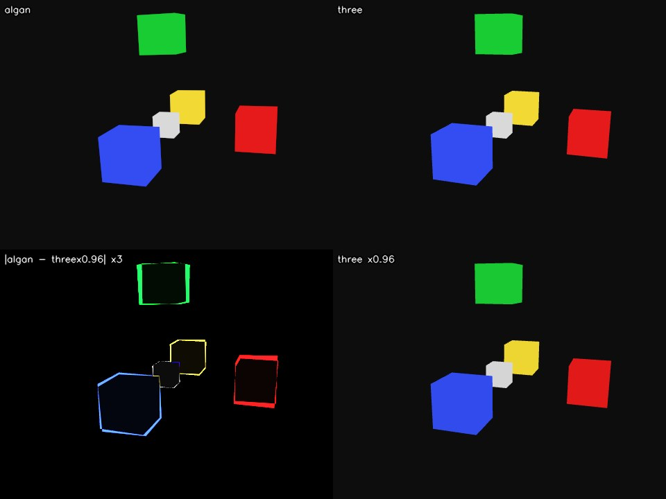
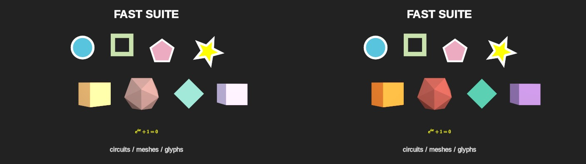
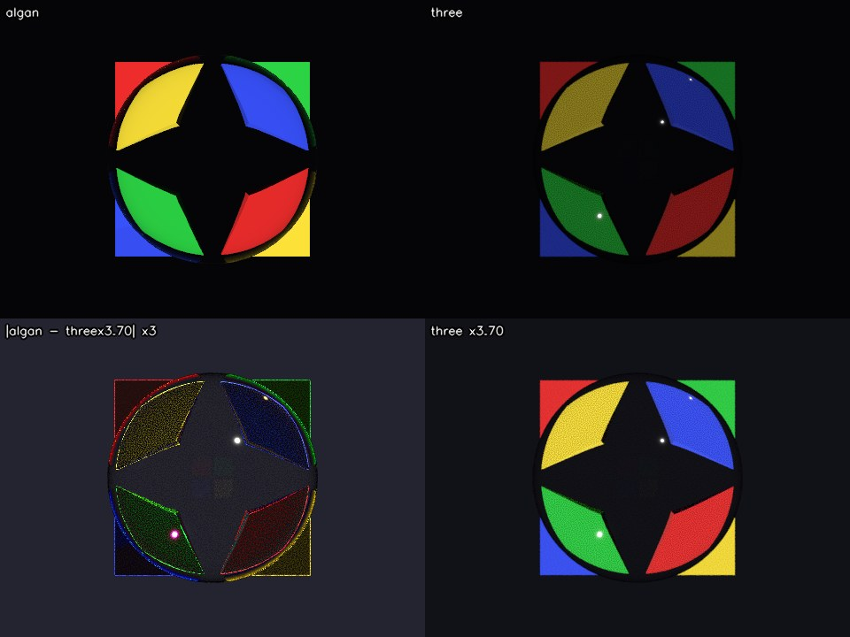
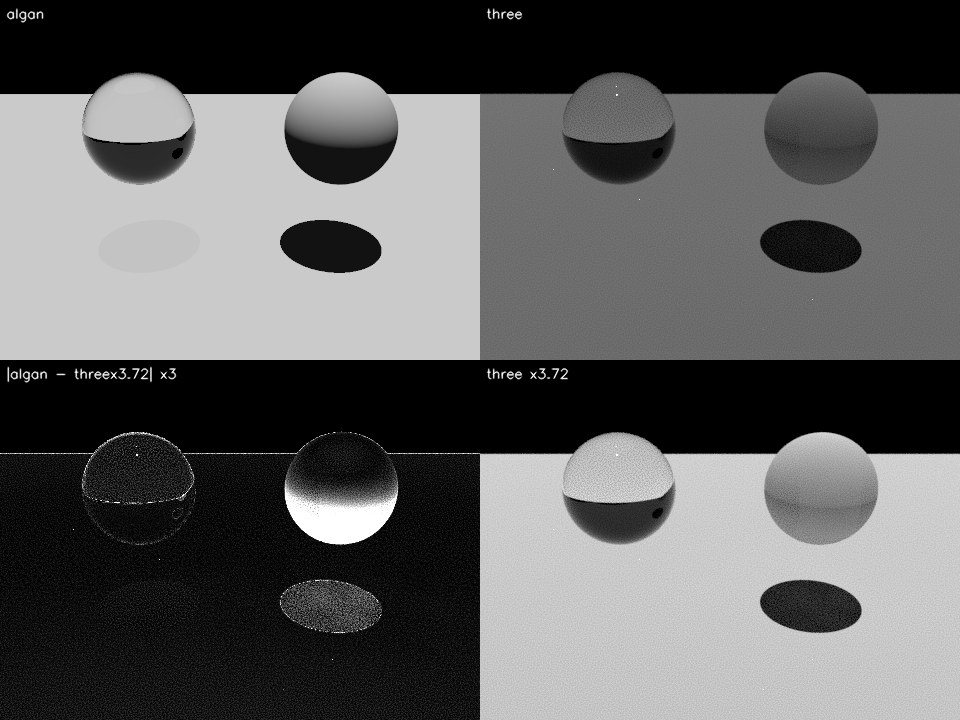
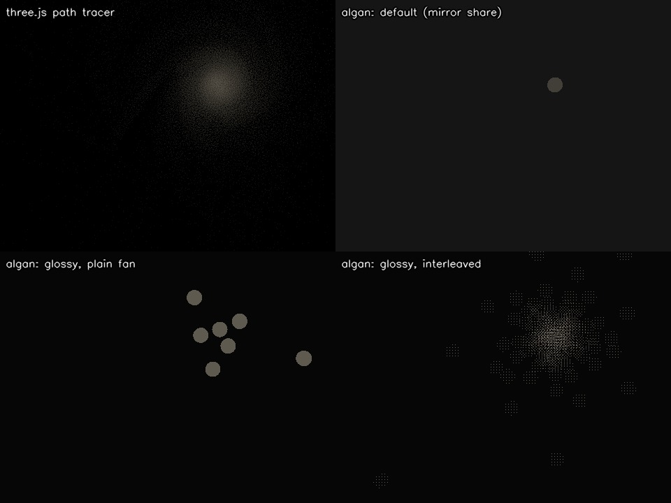
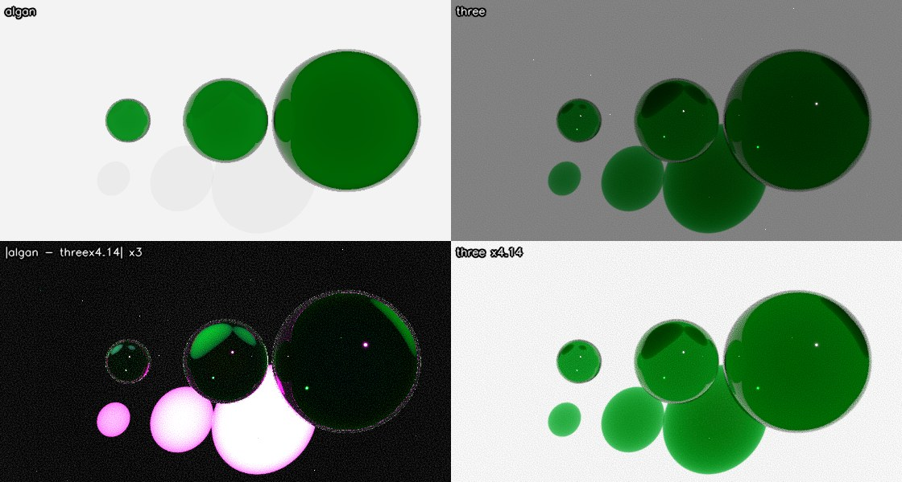
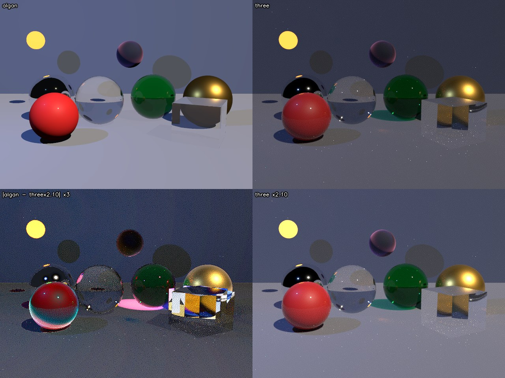

# Algan vs Three.js — a rendering audit

Two renderers, one scene description, the same frame. Where they disagree, this
asks which one is closer to the physics, and fixes the cases where Algan is not
and the fix is contained.

Everything here was measured on this machine (a CPU-only cloud session,
Ubuntu 24.04, 4 vCPU, no GPU — so Algan ran its CPU path throughout). Nothing is
quoted from memory or from a design document without saying so.

Part of the work is Ox Alpha's, run as a subagent through OpenCode: it wrote
`three_render.mjs` (the Three.js back end, both modes), the independent
source-level audit in `OX_AUDIT.md`, the Charlie-sheen helper functions in
`shading_taichi.py` — whose coefficients this audit then checked against the
installed Three.js r185 source and found exact — and the volumetric-absorption
implementation of §4.6. Where its conclusions and this document's differ, §2.1
and §4.9 say so and why.

**This is the second run.** The first run's §2.2 (no colour management) has been
acted on since, by the linear-working-space change, and the point of re-running
was to find out whether the two open items it left — §2.2 and §4.6 — had closed.
One had, half way: §2.2 is now genuinely fixed, but the re-run found the linear
space was only decoding one of the three routes an authored colour takes into
the renderer, and until this run an authored 0.5 grey rendered 188. That, and
§4.6, are what moved; everything marked **[2]** below is new or re-measured in
this run.

## What it found, in one table

| # | Discrepancy | Algan worse? | Done |
| --- | --- | --- | --- |
| §2.2 | **[2]** The linear working space encoded output but decoded only per-vertex colour — a promoted uniform colour, a colour texture and every material-block tint went undecoded. An authored 0.5 grey rendered 188 | yes — the biggest one | **fixed** — the transfer curve is the identity again |
| §4.6 | **[2]** `attenuation_color` / `attenuation_distance` accepted and dropped: coloured glass had no depth | yes | **fixed** — now within 0.003 of the path tracer on every channel |
| §4.1 | A clear glass sphere cast a shadow as dark as an opaque one — 1.0% of the open floor where the reference passes 101.9% | yes, badly | **fixed** — 85.1% |
| §4.2 | Fresnel used the wrong angle leaving a dense medium; at total internal reflection the energy went to the transmitted branch, tinted | yes | **fixed** against the exact equations |
| §4.3 | A per-light transmission glow was added on top of the traced refracted ray | yes | **fixed** — disc 82.4 → 52.7/255 |
| §4.4 | Sheen was `(1 − n·v)^k` with no `n·l`: a light behind the surface still lit its rim | yes, worse than both references | **fixed** — Charlie × Neubelt, rim 109 → 3/255 |
| §4.7 | Two `SETTINGS.raytracing` fields no renderer reads, accepted silently | yes | **fixed** — writing raises |
| §4.5 | **[2]** A rough metal reflects 4.7% of what it should by default; `glossy_reflection=True` gets the energy right (0.555 against 0.523) but its four taps speckle | yes | not flipped — §4.5 measures what the tap count can and cannot buy, and what would actually fix it |
| §2.1 | Diffuse missing `1/π` | **no** — a light-unit convention, now measurable as exactly π | left alone, on purpose |
| §4.8 | **[2]** A flat ambient on every lit surface, 0.01 in linear light | yes, but an artistic default | left alone |
| §4.10 | **[2]** Coloured glass casts a grey shadow where the reference's is green | yes | not fixed; needs an RGB shadow payload (§6) |
| §3 | Refraction, mirror reflection, clearcoat, bounce exhaustion | **no** — refraction beats stock Three.js outright | — |

---

## 1. How the comparison was set up

`SPEC.md` defines a small JSON scene format — camera, lights, spheres and boxes,
`MeshPhysicalMaterial` parameters — chosen so that both engines can express every
field *exactly*. Two back ends consume it:

| back end | what it is | file |
| --- | --- | --- |
| `algan` | Algan's own renderer via `Scene.save_frame` | `algan_render.py` |
| `three_raster` | `THREE.WebGLRenderer` r185, out of the box | `three_render.mjs` |
| `three_pathtrace` | `three-gpu-pathtracer` 0.0.24 on the same scene graph | `three_render.mjs` |

The path tracer matters: Three.js's rasterizer cannot reflect a scene without an
environment map and cannot refract at all, so on exactly the questions this audit
is about it is not a reference. `three-gpu-pathtracer` path-traces the *same*
`MeshPhysicalMaterial` objects, so it is the physically-based reading of the same
material description. Where the two Three.js modes disagree, the path tracer is
the reference and the rasterizer is reported as context.

Three.js ran with its defaults and no fudging toward Algan:
`ColorManagement.enabled = true`, `outputColorSpace = SRGBColorSpace`,
`toneMapping = NoToneMapping`, shadow maps on in the raster pass. Scene colours
are fed through `Color.setRGB(r, g, b, SRGBColorSpace)`, so an authored `0.8`
means the sRGB value `0.8` on both sides.

Algan ran with `SETTINGS.raytracing.set(shadows=True, tonemapping=False)`. Shadows
because Three.js has them on and Algan defaults them off; tonemapping off because
that is what Three.js defaults to — and, since the first run, what Algan defaults
to as well, so the flag is now belt-and-braces rather than a correction. With both
off, the only transfer function in play is the sRGB OETF at the byte write, which
both engines apply.

Algan's tonemapper was checked against the Khronos curve and is a faithful
implementation of it. It now sits in the right place as well as being the right
curve: under the linear working space it takes linear input and the OETF runs
after it, which is three.js's order (`tonemapping_fragment` then
`colorspace_fragment`). Measured on a flat slab, an authored 0.5 grey renders 181
with the curve on and 128 with it off; an authored 0.1 renders 2, because linear
0.01 is genuinely near-black and PBR Neutral's 0.04 pedestal is scaled for
scene-referred values. That is parity, not a discrepancy — three.js does the same
thing to the same input.

### Two things had to be reconciled before any pixel comparison meant anything

**Algan's +z axis points into the screen.** `OUT`, the direction out of the screen
toward the viewer, is `(0, 0, -1)`, and a new Scene's camera sits at `z = -7`.
Three.js and glTF have the opposite sign. Porting a scene means negating every z
coordinate, every z direction, and every rotation about y. The docstring in
`algan/constants/spatial.py` said the opposite ("``OUT``/``IN`` along +z/-z") and
has been corrected as part of this work, along with the same claim in
`shapes_3d.py`.

**Algan's default Scene comes with a light.** `default_scene_initializer` spawns a
white `PointLight` beside the camera. Every scene here replaces the initializer
with one that spawns only the camera, so both engines see exactly the lights the
spec names.

With those settled, `scenes/calib_orient.json` — five unlit boxes, one per signed
axis — renders **identically** in the two engines: the same silhouettes to the
pixel, the same depth order, mean absolute difference 1.29/255 against the
rasterizer, confined to antialiased edges. Camera, field of view, projection and
handedness agree exactly, so everything that follows is shading and transport,
not geometry. Since §2.2 the exposure factor between them is **0.96** as well —
unlit content now matches in absolute value, not only in shape, which is the
sharpest single statement of what that fix bought.



---

## 2. The two global conventions that differ (and why only one is a defect)

`scenes/calib_diffuse.json` is one 0.8-grey roughness-1 metalness-0 sphere lit
head-on by a single white directional light of intensity 1, on black. The centre
pixel is a direct readout of each engine's diffuse convention:

| | centre pixel | as linear radiance |
| --- | --- | --- |
| Algan, first run (tonemapping off) | 217 | 0.673 |
| **Algan, this run** | **202** | **0.591** |
| Three.js raster | **122** | 0.195 |
| Three.js path tracer | 108 | 0.150 |

Three.js's number is exactly what theory says: `srgb_to_linear(0.8) / π = 0.192`,
encoded back to sRGB as 121. Algan's is now `srgb_to_linear(0.8) × (0.01 ambient
+ 0.96 k_d) + specular = 0.589` against 0.591 measured, encoded as 202.

Two independent differences produced the first run's gap. One was a defect and is
fixed (§2.2); the other is a convention and is left alone (§2.1). With the defect
gone the convention is measurable on its own for the first time.

### 2.1 The missing 1/π is a unit convention, not an error

Algan's diffuse term is `k_d · albedo · light_colour · n·l`, with no `1/π`.
Three.js uses `albedo/π`. In linear terms Algan is π× brighter for the same
intensity number: **0.591 / 0.195 = 3.03** against a predicted 3.14, the 3%
remainder being Algan's `k_d = 1 − F = 0.96` at normal incidence. (The first run
measured this ratio as 3.17 and this run, before §2.2 was fixed, as 3.99 — both
contaminated by the missing decode. 3.03 is the first clean reading.)

It is tempting to call that a bug, and Ox Alpha's independent audit
(`OX_AUDIT.md`, finding 1) ranks it first. **I disagree, and this is worth being
precise about.** A constant factor between two renderers is a choice of light
unit, not a physical claim: Algan's `DirectionalLight(intensity=1)` simply means
"irradiance π", i.e. "a white surface facing this light comes out white". Nothing
observable distinguishes that from Three.js's convention except the number the
user types. The renderer's own settings agree — `SETTINGS.raytracing.light_intensity`
defaults to π for exactly this reason.

Dividing the diffuse term by π *on its own* would make every existing Algan scene
3.14× darker and no more physically accurate. It is only worth doing as part of
2.2, which is a real defect, and where the two changes partly cancel.

### 2.2 Colour management — FIXED, but not by the change that was supposed to fix it

The first run's finding was that Algan had no colour management at all: an
authored colour was written out unchanged, so lighting arithmetic ran on
display-referred values and a Lambertian falloff came out as `n·l^2.2` on screen.
The linear working space landed since, and the falloff is now right — the shape
of the terminator on `calib_diffuse`, sampled at fractions of the sphere's screen
radius and normalised to the centre, agrees with Three.js's rasterizer to within
half a percent:

```
r/R                     0.0    0.2    0.4    0.6    0.8    0.9   0.95
Algan                 1.000  0.990  0.954  0.881  0.746  0.627  0.529
Three.js raster       1.000  0.994  0.953  0.882  0.749  0.630  0.535
```

**But the decode was only reaching one of the three routes a colour takes into
the renderer**, and it was the least-used one. `transfer_probe.py` renders a flat
slab at a series of authored greys and reads the centre pixel; at the start of
this run it read:

```
authored               0.05  0.10  0.20  0.30  0.40  0.50  0.60  0.70  0.80  0.90  1.00
as 8-bit                 13    26    51    76   102   128   153   178   204   230   255
unlit, no tonemap        63    89   124   149   170   188   203   218   231   243   255   <- encode(authored)
```

That row is exactly `linear_to_srgb(authored)`: the OETF was being applied at the
byte write with **no matching decode at ingest**. The first run predicted this
failure mode in as many words — "a partial fix is worse than none: decoding
albedo without encoding output, or vice versa, moves everything the wrong way" —
and it is what shipped.

Three things reach the kernel as authored colour, and only the first was decoded:

1. **per-vertex colour arrays** (`tri_colors`, `circuit_colors`,
   `circuit_border_colors`) — decoded by `_decode_merged_colors`;
2. **colour texture maps** — and this is not a corner case. With
   constant-property promotion on (the default), a mob whose colour and material
   are uniform is rendered from a shared **1×1 colour map** in
   `scene["textures"]` instead of per-vertex rows, so *most* content arrives this
   way. On `calib_diffuse` the merged scene held three all-zero `tri_colors` rows
   and the sphere's real 0.8 grey sat in `textures`. Real image textures
   (`ImageMob`, `set_texture`) took the same undecoded route;
3. **the material parameter block's colour slots** — `emissive`, `specular`,
   `specular_color`, `sheen_color`. An unlit slab authored emissive
   (0.5, 0.25, 0.75) rendered (188, 137, 225) instead of (128, 64, 191): too
   bright, and hue-shifted, because the error is per channel and non-linear.

The A/B that pins (2) needs no instrumentation: `ALGAN_PROMOTE_CONSTANTS=0`
rendered the same slab at **128** where the default rendered **188**, because
turning promotion off puts the colour back on the route that was decoded.

Both are fixed. Colour maps decode as they are appended
(`_append_texture(..., is_color=True)`) rather than on the assembled buffer,
because a promoted map can share storage with the per-vertex rows it was sliced
from; material and normal maps are declared not-colour by their caller and are
left alone, and the material block decodes only for primitives on a built-in
pipeline, since a custom fragment pipeline's block is its own layout. After:

```
authored               0.05  0.10  0.20  0.30  0.40  0.50  0.60  0.70  0.80  0.90  1.00
as 8-bit                 13    26    51    76   102   128   153   178   204   230   255
unlit, no tonemap        13    26    51    77   102   128   153   179   204   230   255   <- identity
one directional light    20    30    53    77   102   127   152   177   202   227   252
```

The unlit row is the identity again, and the lit row is now *also* essentially the
identity — which is Algan's light-unit convention (§2.1) stated in one line: a
white surface facing a `DirectionalLight(intensity=1)` comes out the colour it
was authored. The 10/255 floor at authored zero is §4.8's ambient fill.

**This moves every pixel of every render**, so it invalidates the committed
baselines. `tests/fast`'s CPU baseline was regenerated here and verified to
re-pass; the CUDA fast baseline and both `tests/full_renders` sets need
regenerating on the machines that own them (this session is CPU-only, and the
full-render baselines are per machine).

The old and new baselines side by side are the clearest statement of what the
defect was doing (frame 30 of `tests/fast`, old left, new right):



The three-dimensional meshes are authored `ORANGE`, `RED` and `TEAL`, and on the
left they are pale yellow, pale pink and pale mint — every uniformly-coloured mob
washed out by an unmatched encode. The 2-D circuits beside them barely move,
because circuit colour was on the one route that *was* decoded. That split is the
diagnosis, drawn.

---

## 3. Where Algan is already right

Worth stating plainly, because the rest of this document is a list of problems.

**Refraction is genuinely traced, and it is correct.** `scenes/calib_glass.json`
puts a clear ior-1.5 sphere in front of four coloured blocks. Algan produces the
inverted, magnified image a real glass ball produces, with the four-pointed dark
star where total internal reflection takes over at the rim — and it matches the
path tracer's structure closely enough to overlay.



Three.js's **rasterizer cannot do this at all**: its `transmission` samples the
framebuffer behind the object, so the blocks appear the right way up, unrefracted.
On this axis Algan out-performs stock Three.js by a wide margin and matches the
path tracer. Quantitatively, the fraction of the backdrop's brightness that
survives the trip through the ball is **0.913** in Algan against **1.001** in the
path tracer — the reference exceeds 1 because the ball is a lens and concentrates
what it passes, which is the part Algan's single refracted ray per pixel cannot
reproduce.

**Mirror reflection is accurate.** On `scenes/calib_mirror.json`, the fraction of
the floor's brightness that survives reflection in a smooth metalness-1 sphere is
**0.900** in Algan against **0.879** in the path tracer (the material's albedo is
0.95). Three.js's rasterizer scores 0.0 — with no environment map a mirror has
nothing to reflect.

**Clearcoat matches the real-time reference.** Algan adds the coat lobe without
attenuating the base layer, which the glTF spec says to do — but Three.js's own
WebGL renderer does not attenuate it either. Algan is not worse than the reference
it is modelled on.

**Bounce exhaustion degrades gracefully.** At `max_bounces`, the reflection share
falls back into local shading rather than contributing black.

---

## 4. Discrepancies, ranked, with what was done about each

### 4.1 A transmissive solid casts a fully opaque shadow — FIXED

`scenes/calib_shadow.json` puts a clear glass sphere and an opaque sphere of the
same size side by side over a floor, lit straight down, so each shadow sits
directly beneath its sphere and the two are trivial to compare.

| | glass sphere's shadow | opaque sphere's shadow |
| --- | --- | --- |
| Algan, before the fix | **1.0% of the floor** | 1.0% |
| Algan, after (first run) | 85.1% of the floor | 1.0% |
| **Algan, this run** | **92.4% of the floor** | 1.0% |
| Three.js path tracer | 102.6% of the floor | 4.2% |
| Three.js raster | 0% | 0% |

(The glass patch moved from 85.1% to 92.4% between runs because §2.2 changed the
floor's albedo *and* the fraction of it the shadow keeps is measured against that
same floor — what a correct decode changed is the denominator's linearity, not
the shadow march.)

(Linear radiance, each shadow patch as a fraction of the open floor. The glass
patch exceeds 100% in the path tracer because the sphere is a lens and
concentrates light.)

Algan's glass blocked light **exactly as completely as an opaque sphere of the
same size**. The shadow march attenuated by coverage alone —
`transmitted *= 1.0 - alpha` — and never consulted `transmission` or `ior`, so a
window, a wine glass and a brick were the same object to a shadow ray. This was
the single largest structural error found.

Now each shadow-ray hit passes `transmission · (1 - metalness) · (1 - F0)` of the
light it covers. `F0` is the normal-incidence dielectric reflectance rather than
a real angle-dependent Fresnel — the march has no normals and fetching them
would cost the hottest loop in the renderer for a second-order effect — and it is
less of an approximation than it sounds, because a solid presents the march two
surfaces, entry and exit, each taking its own `1 - F0`.

Two things it deliberately does not do, both because the shadow payload is one
scalar per light: it does not bend the light (so there is no caustic core), and
it does not tint it (so the shadow under green glass gets brighter but stays
grey, where the path tracer's turns green). "A transmissive surface stops
blocking light" is the honest description, not "glass casts a correct shadow".

The any-hit shadow fast paths had to be gated: modes 2 and 3 answer "is anything
there" and treat a hit as full occlusion, which stopped being equivalent to the
march once a covered surface can pass light — and a glass ball is `alpha = 1`, so
it does not even register as translucent. A batch containing transmissive
geometry now stays on the ordered march. Scenes without any keep their fast path
and their pixels: `calib_mirror.algan.png` is **byte-identical** across the change.



### 4.2 Fresnel was evaluated on the wrong side of a glass surface — FIXED

`_material_reflectance` applied Schlick's approximation to `abs(rd · n)`
regardless of which side of the interface the ray was on. Schlick is written for
a ray arriving from the thin side; a ray already inside glass reflects far more
than the same incident angle suggests, and past the critical angle it reflects
everything. Measured against the exact Fresnel equations at ior 1.5:

| angle inside the glass | before | after | exact |
| --- | --- | --- | --- |
| 20° | 0.040 | 0.040 | 0.042 |
| 35° | 0.040 | 0.067 | 0.086 |
| 40° | 0.041 | **0.246** | **0.245** |
| 41.8° (critical) | 0.041 | 0.908 | 0.891 |
| 45° | 0.042 | **1.000** | **1.000** |
| 80° | 0.410 | 1.000 | 1.000 |

So light leaving a solid was split six-to-one the wrong way just below the
critical angle, and beyond it, energy that should have been perfectly reflected
was passed through the surface instead. Worse, `_refract_ray` *did* detect total
internal reflection and bent the ray into the mirror direction — but the ray
carried the **transmitted** weight, which is tinted by the glass colour, so a
perfectly achromatic Fresnel reflection came out coloured.

The fix follows KHR_materials_volume's three normative cases: entering, Schlick
on the incident angle; leaving without TIR, Schlick on the air-side angle; leaving
past the critical angle, `F = 1` with the transmitted branch given zero weight.

**Scoped so nothing else moves**: the side test is gated on `transmission > 0`.
The renderer does not track which medium a ray is in, so "the far side of the
surface" is inferred from the normal — sound for a closed transmissive solid,
wrong for a back-facing hit on an ordinary opaque surface, which is not inside
anything. Verified: `calib_mirror.algan.png` is **byte-identical** across the
change (same md5), while `calib_glass` moves, and moves only in a ring at the
sphere's rim and along the arms of the TIR star — exactly where the exit-side
Fresnel acts.

`tests/unit_tests/test_dielectric_fresnel.py` pins all of this against the exact
Fresnel equations, including that an opaque material stays side-blind.

### 4.3 Transmission was counted twice — FIXED

`_stage_physical` added `rgb * lc * (transmission * (1 - metalness) * 0.5)` inside
its per-light loop — a glow proportional to transmission, with no `n·l`, scaling
with the number of lights — on top of the real refracted ray that the scatter
already traces. Glass lit from behind its own horizon still gained it.

The term is not needed even in the cases where no refracted ray is spawned (an
index-matched `ior ≤ 1`, or a batch built without the split pool): the
transmitted share then continues unbent as part of the pass-through
(`pass_w = cover3 + trans_energy * tint`), so the light behind the surface still
reaches the pixel. Meanwhile the stage's own output is already scaled by
`alpha * (1 - R - trans_share)` to make room for it. Removed from both the
Taichi stage and its torch twin.

Measured on a `transmission = 0.75, ior = 1.5` sphere under two point lights,
the mean over its disc drops from **82.4/255 to 52.7/255** — the surface stops
glowing in the lights' colour and shows what is behind it instead.

### 4.4 Sheen was an ad-hoc rim, not a BRDF — FIXED

`sheen * (1 - n·v)^k`, with no `n·l`, no distribution, no normalisation and no
effect on the layer underneath. Replaced with what glTF's KHR_materials_sheen
and Three.js's `BRDF_Sheen` specify, term for term: the Charlie distribution
(Estevez & Kulla 2017), the Neubelt visibility term, `n·l`, and the base-layer
energy compensation `1 − max3(sheenColor) · max(E(n·v), E(n·l))` that stops the
fibre layer adding light the base already spent. The formulas were taken from
the installed Three.js r185 source rather than from memory.

The decisive test is a light placed **behind** the sphere, where a physical
sheen lobe must contribute nothing. Mean rim RGB, and its 99th percentile:

| | rim mean | rim p99 |
| --- | --- | --- |
| before, light in front | (41.1, 30.5, 39.3) | (113, 72, 97) |
| after, light in front | (34.8, 26.2, 33.6) | (46, 31, 40) |
| before, light behind | (29.7, 19.2, 25.7) | (109, 68, 92) |
| **after, light behind** | **(3.0, 3.0, 3.0)** | **(3, 3, 3)** |

With the light behind, the rim now sits at the flat ambient floor (§4.8) instead
of blazing at 109/255. With it in front the lobe is still there but no longer
spikes into a hard bright ring at the silhouette.

Every material that leaves `sheen` at its default is untouched, and provably so:
`sheen = 0` makes the compensation exactly `1.0` and the lobe exactly zero, and
a `MeshPhysicalMaterial` sphere with sheen and transmission at their defaults
renders **byte-identically** across both fixes (same md5).

### 4.5 A rough metal reflects almost nothing — NOT FIXED, but the reason to leave it off is now measurable

Measured on `calib_mirror`, the fraction of the floor's brightness reflected by a
metalness-1 roughness-0.35 sphere:

| | reflection efficiency |
| --- | --- |
| Algan, default settings | **0.047** |
| Algan, `glossy_reflection` on | **0.555** |
| Three.js path tracer | **0.523** |
| Three.js raster (no env map) | 0.042 |

By default a rough metal in Algan reflects **4.7%** of what it should — a factor
of 11. With `SETTINGS.raytracing.set(glossy_reflection=True)` it lands within 6%
of the path tracer, which is as close as this audit measures anything.

The energy is thrown away on purpose. `_mirror_share` scales the Fresnel lobe by
the GGX CDF mass inside a narrow cone, so a single mirror ray carries only the
share of the lobe it can honestly stand for — ~3% at roughness 0.35 — and the
rest falls back to the surface's own shading. For a *metal* that shading has no
diffuse term at all, so what it falls back to is the ambient fill: §4.8's 0.01.
The throttle and the linear working space compound, which is why this is a real
number rather than a rounding error.

**The reason it ships off is a motion artefact, and this run tried to measure
it.** `settings.py` argues that four secondary taps cannot integrate a wide GGX
lobe: the interleaved variant resolves into an ordered dither that crawls as
geometry moves under a screen-fixed pattern, and the plain variant lands as four
discrete ghost copies. Three measurements:

**How many taps you can ask for.** `ALGAN_ANALYTIC_AA_SECONDARY` is a live env
int, so "just use more taps" is a one-line experiment — except that
`analytic_aa_secondary_samples()` **snaps it to 8, 4 or 2**, silently, because
the sub-pixel positions are a compile-time table. 16 and 32 are accepted and
render exactly as 8:

```
  taps  efficiency   speckle   seconds
   off      0.0468    0.0653      15.9
     4      0.5546    0.1905      36.5
     8      0.5555    0.1334      65.4
    16      0.5555    0.1334      21.9      <- identical to 8
    32      0.5555    0.1334      21.3      <- identical to 8
```

(`speckle` is the RMS of the ball's high-pass residual over its own mean;
`seconds` is wall clock on a contended 4-vCPU box and should be read as an order
of magnitude, not a benchmark.)

**How the residual compares with the reference.** The same measurement on
Three.js's path tracer at 64 samples gives **0.373** — nearly three times Algan's
8-tap 0.133. Algan's deterministic glossy reflection is not noisier than the
ground truth it is being compared against; the ground truth is Monte Carlo.

**Whether it crawls — and the setting's comment is right.** The crawl mechanism is
a screen-fixed pattern, so it shows up when geometry slides across pixels.
`glossy_probe.py --crawl` renders a scene twice with the camera nudged **half a
pixel** and reports how much the reflecting content changed as a fraction of its
own brightness. The control is the same measurement with glossy off, where a
mirror ray's direction is a smooth function of position and a half-pixel move
should barely register. `scenes/calib_glossy.json` was added this run to be the
case `settings.py` describes — a rough metal wall whose only light is the
reflection of one small bright emitter:

| | `calib_mirror` (broad floor) | `calib_glossy` (small bright source) |
| --- | --- | --- |
| glossy off (control) | 0.0061 | **0.0001** |
| glossy, interleaved (default) | 0.0062 | **0.0320** |
| glossy, plain fan | 0.0063 | **0.0331** |

On a broad low-contrast reflector, glossy sampling adds nothing at all. On a
small bright source it moves the image **320 times** as much as the control for
half a pixel of camera motion — which is the crawl, quantified. Whoever wrote
that comment had it exactly right, including that it is the high-contrast case
that shows it.

The renders say the same thing more directly than any number:



The path tracer's reflection is a soft glow. Algan's default is a *sharp dim
dot* — the mirror-share throttle rendering a rough metal as a faint mirror. The
plain fan is eight discrete ghost copies of the emitter, and the interleaved
variant is a regular grid of dotted blocks: the 4×4 Bayer tile, unfiltered. Both
glossy arms have the right total energy and neither has the right shape.

#### 4.5.1 What would actually fix it

Worth stating plainly, because "use more taps" is the obvious move and it is the
wrong one. The variance of a stratified estimator falls as `1/sqrt(k)`; going
from 4 taps to 32 buys a factor of 2.8 and costs 8× the secondary rays, and it
still does not make a wide lobe clean. More fundamentally, the artefact the
throttle exists to prevent is **minification aliasing** — a reflected image
compressed into a few pixels — and no amount of point sampling fixes minification
aliasing. Prefiltering does.

Every renderer that gets a wide glossy lobe from one deterministic ray uses the
**split-sum approximation** (Karis 2013):

    ∫ L(l) f(l,v) dl  ≈  [ ∫ L(l) D(l) dl ] · [ ∫ f(l,v) dl ]
                          prefiltered radiance   BRDF integral (DFG)

* The **second factor is analytic** — the environment-BRDF term `F0·A + B`, a
  2-D function of `(n·v, roughness)`. It is the exact directional albedo of the
  lobe, it costs no rays, and it is what `_mirror_share` is standing in for with
  a heuristic. Swapping the heuristic for the analytic term fixes the energy
  outright.
* The **first factor needs a prefiltered radiance**, which an IBL renderer gets
  from a roughness mip chain of its environment map. A ray tracer with no
  environment map has two ways to build one: **screen-space reflection
  filtering** — trace one ray per pixel in the dominant direction, write its
  radiance to its own buffer with the hit distance, and blur that buffer with a
  per-pixel radius set by the lobe's screen footprint before compositing — or
  **ray cones** (Akenine-Möller et al. 2019/2021), which need a prefiltered
  *geometry* representation Algan does not build. VXGI-style cone tracing and LTC
  are the other deterministic answers and need the same.

The screen-space route is the one that fits here, and it is worth noting it fixes
both halves at once: it is deterministic (the ray direction is a smooth function
of position, so nothing crawls), it costs a buffer and one separable pass rather
than any extra rays, and the blur it applies is exactly the prefilter the
minification aliasing needs. In Algan the contained form is a **first-bounce
glossy reflection buffer**: when a primary hit spawns a reflection continuation
above a roughness threshold, give it the full split-sum energy, set its
throughput to 1 and route its accumulation to a second per-pixel buffer, keeping
the factored-out throughput and the blur radius in two more; after the wavefront
drains, composite `A + W · blur(B)`. Deeper glossy bounces keep the present
throttle — one glossy event per pixel is what the separation can represent, and
it is the one that matters.

One more thing worth recording, because it is half-built already: `GLOSSY_INTERLEAVE`
applies a 4×4 Bayer rotation per pixel. That is **interleaved sampling** (Keller &
Heidrich 2001), which is a two-part technique — N samples per pixel offset from an
n×n tile, *followed by a reconstruction filter over that tile*. Algan implements
the first part only, and the visible dither is what the missing second part is for.
The reconstruction pass needs the reflection isolated in its own buffer, which is
the same prerequisite as the split-sum route above.

None of this is shipped here. It is a renderer feature — new arrays, a
compositing pass, a settings gate, the memory model — not a patch, and this audit
measures it and specifies it rather than half-doing it.

### 4.6 No volumetric absorption — FIXED

`attenuation_color`, `attenuation_distance` and `thickness` were accepted by
`MeshPhysicalMaterial`, documented, and then **silently dropped** — they never
reached the GPU. Instead the transmitted ray was tinted by the surface albedo at
*every* interface crossing, so a coloured pane was tinted twice (entry and exit)
and a metre-thick block exactly the same as a thin shell.

`scenes/calib_absorption.json` makes that concrete: three glass spheres of radius
0.55, 1.05 and 1.75, identical material, against a bright backdrop. Because the
two engines disagree on light units (§2.1), the honest measurement is each
sphere's transmitted colour **as a fraction of the backdrop seen directly in the
same image**, which cancels them:

| radius | Algan, before | **Algan, after** | Three.js path tracer |
| --- | --- | --- | --- |
| 0.55 | (0.027, 0.443, 0.064) | **(0.004, 0.297, 0.015)** | (0.004, 0.300, 0.015) |
| 1.05 | (0.027, 0.442, 0.064) | **(0.001, 0.206, 0.004)** | (0.001, 0.207, 0.004) |
| 1.75 | (0.027, 0.443, 0.064) | **(0.000, 0.125, 0.001)** | (0.000, 0.124, 0.000) |

Before, Algan's three spheres were **the same colour to three decimal places**
whatever their size. After, they agree with the path tracer to within 0.003 on
every channel of every sphere — closer than Three.js's own rasterizer manages
(0.451 / 0.307 / 0.184 green), because the rasterizer drives absorption from the
material's `thickness` parameter and Algan, like the path tracer, uses the length
of the path the ray actually took.



The implementation is Beer-Lambert with glTF `KHR_materials_volume` semantics,
`transmittance(d) = attenuation_color ^ (d / attenuation_distance)`, packed into
the material block as an **absorption coefficient**
`sigma = -ln(linear(attenuation_color)) / attenuation_distance` rather than as
the two authored fields — which is what makes "no absorption" the all-zeros
value, the rule that block's zero-padding lives by. The log is taken after the
sRGB decode, matching three.js's decode-at-`Color` behaviour. The wavefront
bounce loop applies `exp(-sigma · d)` to the ray's throughput at a hit that
*leaves* a transmissive solid (`rd · n > 0`), with `d` the distance from the
surface the ray last crossed: for a refracted ray, spawned at the entry surface,
that is exactly its interior chord. Exact for a single convex solid; nested media
each attenuate over their own segment.

Independent of the reference, the numbers also match theory. The centre chords
are `2r` = 1.1 / 2.1 / 3.5 and `sigma_green = -ln(linear(0.85)) = 0.368`, so pure
Beer-Lambert predicts green transmittance ratios of 1.00 / 0.69 / 0.41 relative
to the small sphere. Measured: **1.00 / 0.69 / 0.42**.

### 4.10 Coloured glass still casts a grey shadow — NOT FIXED

`out/calib_absorption.compare.jpg`'s exposure-matched difference panel is now
near-black over the spheres themselves and bright magenta under them, which
isolates what is left: the path tracer's glass spheres cast **green** shadows,
because what reaches the floor has been through the glass. Algan's are pale
rather than black — §4.1's fix lets the light through — but they stay grey,
because a shadow query returns one scalar per light. Fixing it needs an RGB
visibility payload where there is one float today; it is the natural completion
of §4.1 and §4.6 and it is a bigger change than either (§6).

### 4.7 Two settings that silently do nothing — FIXED

`SETTINGS.raytracing.light_intensity` (default π) and
`SETTINGS.raytracing.ambient_light` are read only by `path_trace_physical_stbvh`,
a kernel `tracer.py` never launches — it is referenced only from a test. Setting
either had no effect on any render, silently. (`renderer_limitations.rst` already
said as much; the API just did not.)

Writing either now raises `AlganConfigurationError` naming what to do instead —
a light's own `intensity=` and an `AmbientLight` respectively. Reads still work,
because engine code binds the settings object and reads fields off it on the hot
path, and restoring a captured `SETTINGS.snapshot()` still round-trips them: a
snapshot is not a request to tune anything.

### 4.8 Algan adds an ambient fill to every lit surface — NOT FIXED (documented choice)

Every lit stage adds `albedo × AMBIENT_STRENGTH` with no light in the scene.
Three.js adds nothing without an ambient or environment light. So a fully
shadowed region in Algan can never go quite to black, and a black object glows
slightly. It stands in for the indirect light the deterministic path does not
compute (`indirect_bounce_strength` defaults to 0), and in a scene that *does*
have honest indirect light it double-counts.

The constant moved with the linear working space: **0.01 in linear light where it
was 0.1 display-referred**, which is the same fill in different units
(`srgb_to_linear(0.1) = 0.01003`). The transfer probe reads it as the 10/255 floor
at authored zero under one directional light.

This is an artistic default rather than a physics claim, and changing it would
darken every existing Algan scene. Left alone; recorded here so it is not
mistaken for a bug. It is worth knowing that it interacts with §4.5: for a
*metal*, which has no diffuse term, the ambient fill is the whole of what the
mirror-share throttle hands the reflected energy back to, so the two compound.

### 4.9 Two claims from the independent audit that did not survive checking

`OX_AUDIT.md` was produced by reading the source, not by rendering, and two of
its findings do not hold once measured. Recorded here so nobody chases them.

**"`samples_per_pixel > 1` silently switches the lighting model."** The switch
is real and large — the same scene's floor renders at 171/255 with
`samples_per_pixel = 1` and 20/255 with 4, because the Monte Carlo kernel has no
explicit lights and treats the vertex-shaded colour as emission. But it is not
silent. `docs/source/advanced_user_tutorials/renderer_limitations.rst` states
it in as many words — "`SETTINGS.raytracing.samples_per_pixel` selects the
renderer, not a quality knob" — with a table of what each renderer gives up. And
when the scene uses a feature the Monte Carlo path cannot honour, the render
refuses rather than producing a wrong frame: a directional light raises
`UnsupportedFeatureError: The Monte Carlo renderer selected by
samples_per_pixel > 1 cannot honor: extended lights`, naming the fix.

**"`glossy_reflection` is an experimental switch."** It is in `_PUBLIC_FIELDS`
alongside `shadows` and `max_bounces`; `SETTINGS.raytracing.set(glossy_reflection=True)`
is the supported spelling. (This audit had it wrong too, until the settings
module was read rather than guessed at.)

---

## 5. The main scene

`scenes/showcase.json` — mirror ball, clear glass sphere, tinted glass sphere,
rough gold sphere, clearcoat sphere, glass cube, sheen sphere, emitter, floor and
back wall, under a directional key and a blue point light.



After this run's two fixes the two images read as the same scene: the same floor
tone, the same wall, the same red and green and gold. The exposure factor needed
to match them is 2.10 rather than the 3.14 of §2.1, because the scene's ambient
fill and its several lights do not scale the way one head-on directional light
does. What the exposure-matched difference still picks out is the list of open
items and nothing else: the glass cube (Algan resolves it as thin panes where the
reference refracts it as a solid), the gold sphere's missing blurred surroundings
(§4.5), and the shadow under the green sphere (§4.10).

---

## 6. What a follow-up should do, in order

The first run's items 1 and 2 are done (§2.2, §4.6). What is left, re-ordered by
what the second run learned:

1. **A first-bounce glossy reflection buffer with a screen-space prefilter**
   (§4.5.1). This is now the largest remaining visible error and the only open
   item whose shape is fully worked out: the split-sum DFG term fixes the energy
   analytically and a roughness-driven blur of an isolated reflection buffer
   fixes the shape, with no extra rays and nothing that can crawl. It would also
   let `glossy_reflection` become the default rather than an escape hatch.
2. **Coloured shadows through coloured glass** (§4.10). The natural completion of
   §4.1 and §4.6, and the one thing `calib_absorption` still shows: needs an RGB
   visibility payload where there is one scalar per light today.
3. **Let the secondary tap count go above 8** (§4.5), or say that it cannot.
   `ALGAN_ANALYTIC_AA_SECONDARY=32` is accepted and silently rendered as 8. Even
   done properly it is the wrong lever — see §4.5.1 — but silently ignoring a
   number a user typed is its own small defect.
4. **Sheen albedo scaling and clearcoat base attenuation** (§4.4, §3) if glTF
   conformance rather than Three.js parity is the goal.
5. **Consider decoding the legacy textured-wavefront colour banks**
   (`_build_textured_scene`, `WF_TEXTURED`, off by default and marked
   unsupported): they are promoted from `tri_colors` *before* the decode runs, so
   if that path is ever revived it will have §2.2's bug.

## 7. Files

| file | what it is |
| --- | --- |
| `SPEC.md` | the shared scene format |
| `scenes/*.json` | the scenes; `calib_*` isolate one question each |
| `algan_render.py` | Algan back end |
| `three_render.mjs` | Three.js back end, raster and path-traced |
| `compare.py` | side-by-side contact sheets, raw and exposure-matched |
| `metrics.py` | unit-free transport ratios (transmission and reflection efficiency) |
| `transfer_probe.py` | Algan's authored-colour → pixel transfer curve |
| `glossy_probe.py` | glossy reflection: tap sweep, half-pixel crawl test, contact sheet |
| `OX_AUDIT.md` | Ox Alpha's independent source-level audit |

Reproduce:

```
<venv-python> benchmarks/renderer_audit/algan_render.py \
    benchmarks/renderer_audit/scenes/showcase.json --out out --no-tonemap
node benchmarks/renderer_audit/three_render.mjs \
    benchmarks/renderer_audit/scenes/showcase.json --out out --mode both --samples 64
<venv-python> benchmarks/renderer_audit/compare.py \
    out/showcase.algan.png out/showcase.three_pathtrace.png --out out
```

The Three.js back end needs `npm install three three-gpu-pathtracer playwright`
in a scratch directory; `three_render.mjs` documents how it finds it. The glossy
measurements in §4.5:

```
<venv-python> benchmarks/renderer_audit/glossy_probe.py --taps 4 8 16 32
<venv-python> benchmarks/renderer_audit/glossy_probe.py --crawl 0.008 \
    --scene benchmarks/renderer_audit/scenes/calib_glossy.json
<venv-python> benchmarks/renderer_audit/glossy_probe.py --figure \
    --scene benchmarks/renderer_audit/scenes/calib_glossy.json
```
